# Isaiah Autonomous Content System — Architecture

> Every video is generated end-to-end by this system.
> No manual editing. No hardcoded captions. No preset schedules.

---

## Full System Diagram

```mermaid
flowchart TD
  %% ─── Layer 0: Data Sources ───────────────────────────────────────────────
  subgraph L0["Layer 0 — Data Sources"]
    iPhone["📱 iPhone Camera Roll\n(AFC protocol, Wi-Fi)"]
    MyPassport["💿 MyPassport Audio Library\n(local drive, 28+ tracks)"]
    TrendDB["📊 Supabase Trend Data\n(actp_twitter_feedback,\nyoutube_video_stats)"]
    ICPDB["👥 ICP / Offer Registry\n(PLATFORM_ACCOUNTS, OFFERS,\nICP_PROFILES — in code)"]
  end

  %% ─── Layer 1: Media Ingestion ────────────────────────────────────────────
  subgraph L1["Layer 1 — Media Ingestion (media-vault)"]
    ingest["⬇️ Parallel AFC Download\nCONCURRENT_DOWNLOADS=16\nBATCH=16, CHUNK=500"]
    analysis["🤖 AI Vision Analysis [AI LAYER]\nClaude Haiku Vision:\n· quality_score (0-10)\n· is_talking_head / is_broll\n· face_present, mood, energy\n· niche, platform_fit\n· hook_potential, caption"]
    store["🗄️ Supabase mv_media_items\nlocal_path, analysis_status,\nai_quality_score, ai_is_talking_head"]
  end

  %% ─── Layer 2: Decision Engine ────────────────────────────────────────────
  subgraph L2["Layer 2 — Decision Engine  🤖 AI SCORING LAYER"]
    selectAccount["selectAccount()\n→ Score: pillar overlap × topic + trends\n→ Picks best account per brand"]
    selectOffer["selectOffer()\n→ Score: platform fit × ICP intersection\n→ Selects highest-fit monetization offer"]
    selectICP["selectIcp()\n→ Score: account-offer ICP overlap\n→ Resolves target audience profile"]
    selectFunnel["selectFunnelStage()\n→ Weighted random: account mix × ICP bias\n→ Determines awareness level for this post"]
    selectNarrative["selectNarrative()\n→ Preferred narrative per funnel stage\n→ Controls story structure of the video"]
    selectBroll["selectBroll()\n→ Score: topic×0.3 + ICP×0.2 +\n  aesthetic×0.3 + readability×0.2\n→ Ranked B-roll insertion list"]
    selectAudio["selectAudio()\n→ Energy match: problem_aware→0.4,\n  solution_aware→0.55, product_aware→0.75\n→ Background track selection"]
    overallScore["computeSelectionScore()\n7-factor weighted composite:\nofferFit×0.22 + icpFit×0.18 +\nplatformFit×0.14 + trendFit×0.12 +\nbrollFit×0.14 + audioFit×0.08 +\nstyleMatch×0.12"]
  end

  %% ─── Layer 3: AI Copy Generation ─────────────────────────────────────────
  subgraph L3["Layer 3 — AI Copy Generation  🤖 CLAUDE API LAYER"]
    summaryStrap["buildSummaryStrapPrompt() → Claude claude-sonnet-4-6\nGenerates 5 summary strap candidates\nw/ faithfulness + curiosity + style scores\nPicks highest overallScore"]
    captionGen["buildCaptionPrompt() → Claude claude-sonnet-4-6\nPlatform-tuned caption + hashtags\nICP language + offer CTA embedded\nFirst comment for engagement boost"]
    textPlacement["Face-safe text placement\ngetCaptionYOffset(faceBoxes)\nNever overlaps speaker face\nAuto-adjusts to safe zone"]
  end

  %% ─── Layer 4: Rendering ──────────────────────────────────────────────────
  subgraph L4["Layer 4 — Rendering (Remotion)"]
    transcode["ffmpeg transcode\n→ 540p fast-start MP4\n-movflags +faststart"]
    compose["IsaiahTalkingHeadV1\nComposition assembly:\n· Top name bar\n· Summary strap (AI-generated)\n· Talking head video\n· Face-safe captions\n· Zoom on emphasis moments"]
    render["npx remotion render\n1080×1920 h264 MP4\n@30fps, --frames=0-899"]
  end

  %% ─── Layer 5: QA ─────────────────────────────────────────────────────────
  subgraph L5["Layer 5 — QA Validation  🤖 VALIDATION LAYER"]
    qaChecks["runQAChecks()\n10-point validation:\n· top_name_present\n· summary_strap_not_empty\n· captions_aligned\n· face_not_overlapped\n· brief_alignment ≥ 0.6\n· transcript_fidelity ≥ 0.7\n· style_match ≥ 0.7\n· source_fit ≥ 0.5\n· no_banned_phrases\n· cta_present"]
    publishDecision["publishDecision\npass → proceed to publish\nfail → log + skip this clip"]
  end

  %% ─── Layer 6: Publishing ─────────────────────────────────────────────────
  subgraph L6["Layer 6 — Publishing (Blotato)"]
    storageUpload["Supabase Storage\npipeline-renders bucket\n→ public CDN URL"]
    blotatoMedia["POST /v2/media\nblotato-api-key header\n→ registers asset, returns mediaId"]
    blotatoPost["POST /v2/posts\naccountId + caption + mediaId\n→ live post on platform"]
    telegramNotif["📲 Telegram notification\n→ 'Posted to @handle'\n→ platform URL\n→ offer + ICP + score summary"]
  end

  %% ─── Layer 7: Feedback Loop ──────────────────────────────────────────────
  subgraph L7["Layer 7 — Feedback Loop  🤖 ML OPTIMIZATION LAYER"]
    perfFetch["Performance fetch\n24h / 7d metrics:\nviews, saves, reach, engagement"]
    perfScore["Score computation\nContent-tier assignment:\ntop / strong / average / weak"]
    thompson["Thompson Sampling\nBeta(α, β) distribution\nMulti-armed bandit:\n· 70% exploit best\n· 20% explore variants\n· 10% mutate parameters"]
    reweight["Weight re-training\nUpdate SCORING_WEIGHTS\nbased on actual performance\n→ closes the loop"]
  end

  %% ─── Connections ─────────────────────────────────────────────────────────

  iPhone --> ingest --> analysis --> store
  MyPassport --> selectAudio
  TrendDB --> selectFunnel
  ICPDB --> selectAccount & selectOffer & selectICP

  store --> selectAccount
  store --> selectBroll

  selectAccount --> selectOffer --> selectICP --> selectFunnel --> selectNarrative
  selectBroll --> overallScore
  selectAudio --> overallScore
  selectFunnel --> selectBroll & selectAudio

  selectNarrative --> summaryStrap
  selectICP --> captionGen
  selectOffer --> captionGen
  overallScore --> summaryStrap

  summaryStrap --> textPlacement
  captionGen --> textPlacement
  textPlacement --> compose

  store --> transcode --> compose
  compose --> render

  render --> qaChecks --> publishDecision
  publishDecision -->|pass| storageUpload
  storageUpload --> blotatoMedia --> blotatoPost --> telegramNotif

  blotatoPost --> perfFetch --> perfScore --> thompson --> reweight
  reweight -->|update weights| overallScore

  %% ─── Styling ──────────────────────────────────────────────────────────────
  style L2 fill:#1a3a1a,stroke:#7DFF63,color:#7DFF63
  style L3 fill:#1a2a3a,stroke:#63C8FF,color:#63C8FF
  style L5 fill:#2a1a2a,stroke:#FF63C8,color:#FF63C8
  style L7 fill:#2a2a1a,stroke:#FFC863,color:#FFC863
  style L0 fill:#1a1a1a,stroke:#666,color:#ccc
  style L1 fill:#1a1a1a,stroke:#888,color:#ccc
  style L4 fill:#1a1a1a,stroke:#888,color:#ccc
  style L6 fill:#1a1a1a,stroke:#888,color:#ccc
```



---

## AI Decision Making Layers — Quick Reference

| Layer | Type | What AI Decides | Model / Method |
|-------|------|-----------------|----------------|
| **L1 — Vision Analysis** | Generative AI | Quality score, face presence, mood, niche, hook potential, caption | Claude Haiku Vision |
| **L2 — Decision Engine** | Rule-based Scoring AI | Account → Offer → ICP → Funnel stage → Narrative → B-roll → Audio | Weighted scoring functions |
| **L3 — Copy Generation** | Generative AI | Summary strap (5 candidates + scores), platform caption, hashtags, CTA | Claude claude-sonnet-4-6 |
| **L5 — QA Validation** | Deterministic AI | Pass/fail on 10 quality checks, publishDecision | Schema + score thresholds |
| **L7 — Feedback Loop** | ML Optimization | Beta distribution sampling, weight updates based on actual performance | Thompson Sampling bandit |

---

## Autonomous Execution Flow

```
iPhone video detected
  → media-vault AI analysis (L1)
    → Decision Engine picks: account + offer + ICP + funnel + narrative + B-roll + audio (L2)
      → Claude generates: summary strap + caption (L3)
        → Remotion renders: 1080×1920 MP4 (L4)
          → QA validates: 10-point check (L5)
            → Blotato posts: to platform (L6) + Telegram notifies
              → Metrics scraped 24h later → Thompson Sampling updates weights (L7)
```

**Every decision is scored, logged to Supabase, and feeds back into the next run.**

---

## Account → Offer → ICP Mapping (v1.2)

| Account | Platform | Blotato ID | Primary Offer | Primary ICP | Funnel Mix |
|---------|----------|-----------|---------------|-------------|------------|
| `isaiah_instagram` | Instagram | 807 | automation_services | founders_operators | 35/30/20/15 |
| `isaiah_tiktok` | TikTok | 243 | content_system_offer | creators_builders | 45/30/15/10 |
| `isaiah_youtube_shorts` | YouTube | 228 | automation_services | engineers_tech_learners | 25/35/25/15 |
| `everreach_instagram` | Instagram | — | everreach_app | relationship_driven_networkers | 35/30/20/15 |
| `everreach_tiktok` | TikTok | 710 | everreach_app | relationship_driven_networkers | 50/25/15/10 |
| `portalcopyco_instagram` | Instagram | 1369 | email_marketing_course | solopreneurs_women_business_owners | 35/35/20/10 |

---

## Tests Coverage Matrix

| Test File | What It Tests |
|-----------|---------------|
| `tests/test_pipeline_e2e.ts` | Full 13-stage pipeline: Supabase → Decision Engine → Remotion render → Storage → Research → Feedback |
| `tests/test_autonomous_content.ts` | AI Decision Engine unit tests + B-roll/audio scoring + AI caption generation + live Blotato publish + Telegram |
| `tests/test_ingest_parallel.py` (media-vault) | Parallel download: CONCURRENT_DOWNLOADS=16, CHUNK=500, checkpoint math |
