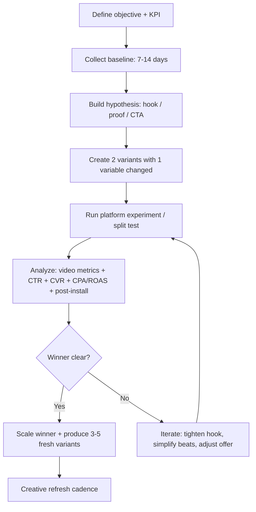

# Sora Prompt Engineering for UGC-Style Performance Ads in Software Apps and E-Commerce

## Executive summary

UGC-style ads (or “creator-native” ads) keep winning in short-form feeds because they match what users came to watch: human-first, fast, problem-led stories with a clear payoff and a simple CTA. TikTok’s own guidance consistently emphasizes (a) hooking immediately, (b) stating the proposition in the opening seconds, (c) using captions/overlays, and (d) ending with a direct CTA—paired with systematic testing rather than “one perfect video.” citeturn13search3turn11search2turn11search6turn15search0

Sora prompting for UGC ads is less about “writing ad copy” and more like briefing a director for a **short, phone-shot scene**: specify framing, lighting, motion, beats, and short dialogue lines the model can plausibly sync. OpenAI’s Sora 2 prompting guidance explicitly recommends shot clarity, simple motion, and dialogue that is brief enough to fit the clip length. citeturn4view1turn17search0turn13search1turn14search2

The practical constraint: **Sora cannot generate real people (including public figures) and rejects human-face image inputs in many workflows**; it also rejects copyrighted characters/music. That means your “UGC” in Sora should be (1) a **fictional creator** or (2) an approved **consent-based character**—and you should avoid implying a real customer testimonial unless it truly is one and properly disclosed. citeturn14search2turn14search1turn14search5

From ad-platform case studies (TikTok for Business + Think with Google), the highest-performing UGC patterns repeatedly combine: **native creator delivery + direct product demonstration + platform-fit CTA**. In app-install and e-commerce examples, moving from polished ads to UGC-style/creator-led formats is repeatedly associated with lifts in CTR/ROAS and reduced costs (CPI/CPC/CPA), especially when campaigns continuously rotate fresh creatives. citeturn5search0turn5search6turn5search9turn5search16turn5search19turn8search0

This report includes a prompt library of **22 templates (11 software, 11 e-commerce), each with 3 tone/length variants**, a comparative table, **6 fully written scripts + shot lists**, and a platform-specific testing plan using official experiment tools and metric definitions. citeturn15search0turn12search0turn12search2turn12search3turn8search0

## Sora prompt style and constraints

Sora prompt engineering is best understood as a **shot-spec** (like a compact storyboard brief) rather than a single paragraph of “ad ideas.”

### Definition of Sora prompt style

OpenAI’s Sora 2 prompting guidance recommends describing a shot as if sketching it onto a storyboard: **camera framing, depth of field, action in beats, lighting/palette**, plus consistent phrasing across shots to reduce character drift. citeturn4view1turn17search0

A particularly useful pattern is a labeled structure—**Prose description → Cinematography → Actions → Dialogue**—because it separates what the model should render visually vs what it should speak (and helps you keep dialogue short enough to sync). citeturn4view1turn17search0

For dialogue/audio, the Sora 2 guide is explicit: dialogue must be written directly, exchanges should be short, and multi-speaker scenes should label speakers consistently; it also notes that ~4 seconds only supports a couple short lines, while longer speeches may break pacing. citeturn17search0turn13search1

### Core generation constraints that affect “UGC-style” ads

Sora constraints matter more for UGC than for purely cinematic content because UGC normally relies on real creators, real homes, real brands, and trending audio—many of which are restricted or brittle in generative video.

**Identity and likeness**
- The OpenAI API guide for Sora states: **real people (including public figures) cannot be generated**, and **input images with human faces are rejected**; the help guidance similarly notes that uploading images depicting real people is blocked and likeness use must go through characters with explicit permission. citeturn14search2turn14search1turn14search5

**Copyright rejections**
- The API guide also states **copyrighted characters and copyrighted music will be rejected**, which means you should not prompt “use [popular song]” or reference famous fictional characters. citeturn14search2

**Duration/orientation and stitching**
- In the Sora app, you can set **Portrait or Landscape** and generate **10s or 15s** clips; storyboards can enable longer clips (e.g., 25s on web in some tiers), and **stitched videos can be up to 60 seconds** (combined clips). citeturn14search1turn7view0  
- OpenAI’s Sora 2 prompting guide also advises that **shorter clips tend to follow instructions more reliably**, and suggests stitching shorter segments (e.g., two 4-second shots) rather than forcing a longer single shot. citeturn13search1turn17search0

**Watermarking and provenance**
- OpenAI documents that Sora outputs include **visible watermarking and C2PA provenance metadata** by default (with limited exceptions in some legacy Sora 1 flows). citeturn7view0turn13search2turn14search5

### Prompting implications for UGC-style ads

Because the “real person” route is blocked, your Sora UGC ads should generally use:
- a **fictional creator persona** (“a 27-year-old office worker filming a selfie video, not resembling any real person”), or  
- a consent-managed character you own/are authorized to use (when available). citeturn14search5turn14search2

Because copyrighted music is rejected, treat audio like a **directional intent** (“low-key royalty-free beat, soft room tone”) and plan to add platform-licensed music in post if needed. citeturn14search2turn13search3

Because short-form ads must hook fast, structure Sora clips as **tight beats**: hook (0–2s), demo/proof (2–10s), CTA (final 2–3s)—which aligns with TikTok’s repeated guidance about hooks in the opening seconds and a clear CTA. citeturn11search2turn13search3turn11search6

## What high-performing UGC ads have in common

“UGC-style” is not one format; it’s a cluster of creative signals that the feed interprets as authentic, useful, and native.

### Platform-native creative signals

TikTok’s creative guidance repeatedly emphasizes:
- **Authenticity and spontaneity** (“authenticity wins” and ads should feel like native content). citeturn0search2turn13search3  
- A **tight three-step story**: relatable problem → introduce solution → end with benefit/transformation. citeturn0search2  
- **Deliver value/emotion within ~10–20 seconds** for short-form platforms (TikTok, Reels, Shorts). citeturn13search3  
- Performance-best-practice mechanics: hook early, state proposition in the first seconds, captions/overlays, and a strong CTA. citeturn11search2turn17search1

YouTube Shorts ad guidance is consistent with “keep it Shorts-native”: ads can be longer, but Google recommends **<60 seconds** to match Shorts behavior; only the first 180s plays in-feed for longer assets. citeturn8search0

### Creative mechanics that map well into Sora prompts

Sora prompting guidance and TikTok creative guidance align on a key principle: **clarity over complexity**. Sora 2 prompting advice stresses clear actions in beats and simple motion, while TikTok’s creative recommendations stress quick comprehension, captions, and immediate framing. citeturn4view1turn17search1turn13search3

That produces a practical “Sora UGC” rule: generate **short, high-clarity scenes** that you can stitch and caption, rather than trying to generate a single dense, multi-location mini-commercial. citeturn13search1turn7view0

## Case-study analysis of top-performing UGC examples

This section synthesizes recurring patterns from **official ad-platform case studies** (TikTok for Business; Think with Google) and related platform documentation.

### Software apps

In a TikTok case study, entity["company","NOICE","podcast app, tiktok cs"] explicitly used a “UGC twist” (humorous, relatable creator-native videos) for App Install campaigns; reported outcomes included **CVR >10.5%**, **CPI down 62%** vs previous non-UGC campaigns, and **76% of TikTok-acquired downloaders becoming active users** (as defined in the case study). citeturn5search0  
**Interpretation:** “UGC twist” worked as a pre-qualification mechanism—viewers who liked the content style were more likely to become active users. That suggests Sora prompts should prioritize *the experience of use* (what it feels like) rather than feature lists. citeturn5search0

A TikTok SMB case study for entity["company","Dyme","personal finance app, nl"] describes using **Spark Ads** (boosting native organic content) and “short, relatable videos based on everyday money struggles,” with reported improvements including **20% decrease in CPC**, **70% increase in CTR**, and **30% increase in ROAS**. citeturn5search9turn11search3  
**Interpretation:** the creative win condition is *scenario realism + a crisp payoff*. For Sora, that translates into plainly staged “everyday struggle → app fix” beats with minimal moving parts. citeturn5search9turn4view1

For gaming, TikTok’s case study on entity["company","Lessmore","mobile game publisher"] describes shifting toward TikTok Creative Challenge creator-generated UGC-style ads for “Eatventure,” generating hundreds of creator videos and scaling activity dramatically (the case study calls TikTok the #1 iOS UA channel for iOS users and iOS IAP during that period). citeturn5search6  
**Interpretation:** UGC at scale is partly a **volume and iteration** problem, not just a “single best script.” The Sora equivalent is a prompt system that can reliably output many variants (hooks, personas, objections) without needing new production each time. citeturn5search6turn15search0  
(If you reference this game specifically, it is commonly styled as entity["video_game","Eatventure","mobile idle game"].) citeturn5search6

TikTok’s case study on entity["company","LuckyTrip","travel deals app"] highlights a “test-and-see” approach, using influencer-created and UGC content for most creative and iterating quickly. citeturn5search12  
**Interpretation:** Your Sora prompt library should be designed around fast recombination (swap: hook, persona, setting, offer) and structured A/B tests rather than bespoke cinematic scripts. citeturn5search12turn15search0

Finally, Think with Google documents that entity["company","Shopee","sea ecommerce platform"] used vertical video in App campaigns on YouTube and reported improvements in app installs and CPI in that example, reinforcing that vertical short-form creative isn’t just for “branding”—it can drive measurable app outcomes. citeturn16search1turn16search4

### E-commerce

TikTok’s case study for entity["company","Wonderskin","cosmetics brand"] highlights using creator-generated content designed to feel authentic; reported results include **large lifts in ROAS/CTR** and reduced CPC in the time window described. citeturn5search16  
**Interpretation:** for Sora, “authentic-feeling” is an execution detail: phone mic feel, imperfect lighting, quick cuts, and a single clear product moment—exactly the sort of controls Sora prompts can specify (handheld jitter, home lighting, one main action). citeturn5search16turn14search1turn4view1

In TikTok’s Black Friday case study for entity["company","Edikted","fashion retailer"], the reported approach combines Video Shopping Ads plus a large creator campaign (500+ creators mentioned) and explicitly calls out **A/B testing** different ad types and CTAs (including Spark Ads variants with different CTA treatments). citeturn15search3turn11search3  
**Interpretation:** for e-commerce, “UGC winning creative” is commonly modular: hook + product proof + offer/urgency + CTA. The Sora prompt should generate *clean proof shots* (try-on, close-ups, unboxing, before/after where policy-allowed) that can be swapped under multiple hooks. citeturn15search3turn11search2turn11search0

TikTok’s regional case study for entity["company","Sephora","beauty retailer"] describes a creative program supplying consistent UGC/human-centric creatives and **localized closed captions** across markets. citeturn5search3  
**Interpretation:** captions are core performance infrastructure, not decoration—so you should design Sora scenes with “caption-safe” framing and plan for post-production overlays. citeturn5search3turn17search1

Think with Google’s Black Friday piece on entity["company","Matt Sleeps","dutch mattress brand"] states that ads featured “user-generated content (UGC) of real people” talking about experiences, with stronger CTAs closer to peak season as they optimized for conversions. citeturn5search19  
**Interpretation:** UGC works across the funnel, but CTA/offer intensity should change by funnel stage. Your Sora prompts should therefore come in families: “curiosity hook” (mid-funnel) and “deal/urgency hook” (low-funnel). citeturn5search19turn15search5

TikTok’s case study for entity["company","Bears with Benefits","supplements brand"] explicitly describes producing most content in-house with “smartphone, ring light, and microphone,” focusing on the first seconds to force “thumbs stop,” and showing product effects/USPs. citeturn8search11turn17search1  
**Interpretation:** “UGC look” is a reproducible spec: you can prompt Sora for a phone-shot aesthetic, practical home lighting, and tight framing that keeps the product visible. citeturn8search11turn14search1

## Hooks, narrative structures, cues, CTA patterns, and compliance

This section converts the evidence above into promptable creative rules.

### Hook patterns that reliably translate into Sora scenes

TikTok performance guidance contains two time-based rules that matter operationally:
- State the proposition within the **first ~3 seconds**. citeturn17search1  
- Build/maintain the hook through the **first ~6 seconds**. citeturn17search1

In practice, the strongest “Sora-friendly” hook types are those you can express visually in one shot:
- **Problem-in-frame:** the “before” state is immediately obvious (messy inbox, overdrawn account anxiety, too many tabs, skincare meltdowns). This matches TikTok’s “relatable problem” opener. citeturn0search2  
- **Pattern interrupt demo:** the product appears in the first beat. TikTok explicitly notes showing product on screen and building clear branding cues in the body of the ad. citeturn11search6turn17search1  
- **Confession/diary line:** “I didn’t realize I was doing this wrong…” This matches the UGC “talking to camera” norm that TikTok recommends (feature people; DIY/not overly polished). citeturn17search1

### Narrative structures

A consistent synthesis that aligns with TikTok’s own structure guidance is:

**Hook → Body (proof) → Close (CTA)** citeturn11search6turn17search1  
- **Hook:** problem or curiosity in one line/visual.  
- **Body:** proof, demo, or transformation in 1–2 beats.  
- **Close:** explicit next action.

For short-form social, TikTok further recommends a three-step story: relatable moment → product introduced naturally → clear benefit/transformation. citeturn0search2  
This maps cleanly into Sora prompts that list actions as discrete beats (Action 1, Action 2, Action 3). citeturn4view1

### Visual and audio cues that cue “UGC”

**Visual cues**
- **Phone-shot realism:** handheld micro-jitter, autofocus breathing, home lighting, and imperfect framing (but product still readable). TikTok explicitly recommends DIY/not overly polished aesthetics for TikTok-first creatives. citeturn17search1  
- **UI-safe composition:** avoid placing critical visuals where platform UI overlays sit; TikTok explicitly flags keeping content in the safe zone. citeturn17search1  
- **Simple motion:** Sora’s guidance says movement is hard; each shot should have one camera move and one clear subject action, described in timing beats. citeturn4view1turn17search0

**Audio cues**
- TikTok and OpenAI both treat audio as essential: TikTok recommends music/sound/dialogue for storytelling, and Sora 2 is positioned as generating synced audio including dialogue and sound effects. citeturn13search3turn13search0turn13search18  
- Keep dialogue short and natural; Sora’s prompt guidance is explicit that long speeches often won’t sync well. citeturn17search0

### Length and pacing recommendations by platform and by Sora constraints

Sora app generation defaults (10s/15s) effectively force you into performance-ad pacing. citeturn14search1  
Platform guidance supports this “short wins” thesis:
- TikTok’s creative guide recommends delivering value/emotion within **10–20 seconds** in short-form social. citeturn13search3  
- YouTube Shorts ad guidance recommends **<60 seconds** to match Shorts behavior (even though longer assets can technically run). citeturn8search0

Operationally, if you need longer story (e.g., testimonial + demo + offer), use:
- **two 10–15s clips** and stitch + edit, or  
- storyboard-based longer clips where available, with the understanding that Sora guidance favors shorter clips for instruction following. citeturn7view0turn13search1turn17search0

### CTA patterns

TikTok’s performance guidance is explicit: end with a **strong CTA** and guide users on what to do. citeturn11search2turn17search1  
UGC-style ads commonly use CTAs that feel like “help,” not “hard sell” (e.g., “Try it for free,” “See how it works,” “Shop the shade I used”), but should still be explicit.

For Spark Ads specifically, TikTok describes Spark Ads as boosting organic posts while attributing engagement to the organic post—useful when you want paid distribution without losing the social proof context. citeturn11search3

### Compliance and legal considerations

This is the highest-stakes part of UGC-style ads because the format invites “testimonial-like” claims.

**Endorsements and disclosures (US)**
- The entity["organization","Federal Trade Commission","us consumer protection agency"] notes that its Endorsement Guides were revised in June 2023, and that truthful advertising principles apply to social media, reviews, and influencer techniques. citeturn8search2turn8search6  
- The FTC announced a final rule in August 2024 aimed at combating fake reviews/testimonials, including prohibiting their sale/purchase and allowing civil penalties for knowing violations. citeturn8search34

**Platform policies against misleading claims**
- TikTok’s Advertising Policies prohibit misleading claims and exaggerated promises (examples include unrealistic financial promises and cure claims). citeturn11search0  
- TikTok’s healthcare policy states (among other restrictions) that cosmetic/beauty product ads **cannot make medical claims**; medical-claim content requires appropriate licensing/certification. citeturn8search3  
- Google Ads policies prohibit misrepresentation and misleading content, and explicitly require disclaimers for testimonials claiming specific results (results may vary; no guarantee). citeturn8search5turn8search9turn8search17

**UGC labeling and paid partnership disclosure**
- TikTok’s disclosure settings label posts as “Promotional content” or “Paid partnership” depending on whether you promote your own brand or someone else’s; TikTok also provides related documentation on commercial content disclosure. citeturn11search1turn11search9

**AI provenance**
- OpenAI documents visible watermarking and C2PA provenance for Sora outputs; do not attempt to misrepresent AI-generated footage as “a real customer video.” Treat it as dramatization/reenactment unless it is truly user-generated by a real user. citeturn7view0turn13search2turn14search5

## Sora prompt template library

This library is designed so you can swap: **hook**, **persona**, **pain point**, **proof moment**, and **CTA**, while keeping Sora-friendly constraints (simple beats; short dialogue). citeturn4view1turn17search0turn13search1

### How to use these templates effectively

1) Pick a template aligned to objective (trial signups vs purchases vs installs).  
2) Fill placeholders (e.g., `[APP_NAME]`, `[PRODUCT_NAME]`, `[OFFER]`).  
3) Generate a 10s or 15s version first (faster iteration). citeturn14search1  
4) If it works, produce 2–4 variants (new hooks, new objections) and stitch into a 25–60s “fuller story” if you need it. citeturn7view0turn15search0turn17search0  
5) Add captions/overlays in post; TikTok explicitly recommends captions/text overlays with readable pacing. citeturn17search1turn5search3

### Comparative table of templates

Recommendations in “Ideal length” and “Best platform” align with platform guidance that short-form social favors fast, vertically designed storytelling and that YouTube Shorts ads are typically best kept under ~60 seconds. citeturn13search3turn8search0turn17search1

| Template ID | Category | Objective | Target audience | Ideal length | Best platform |
|---|---|---|---|---|---|
| SA1 | Software | App installs | Broad mobile users | 10–15s | TikTok, YouTube Shorts |
| SA2 | Software | Free trial | SaaS evaluators | 15–25s | Reels, YouTube Shorts |
| SA3 | Software | Activation | New users stuck on setup | 10–15s | TikTok, Reels |
| SA4 | Software | Retargeting | Site visitors/non-buyers | 10–15s | Facebook, Reels |
| SA5 | Software | Social proof | Skeptics, comparison shoppers | 15–25s | YouTube Shorts, Facebook |
| SA6 | Software | Productivity | Knowledge workers | 10–15s | TikTok, Reels |
| SA7 | Software | Fintech | Budget-conscious adults | 10–15s | TikTok, YouTube Shorts |
| SA8 | Software | Healthtech | Wellness-first consumers | 15s | Reels, TikTok |
| SA9 | Software | B2B lead gen | Founders/operators | 15–25s | Facebook, YouTube Shorts |
| SA10 | Software | Feature reveal | Existing audience | 10s | TikTok (organic + paid) |
| SA11 | Software | Objection handling | “Too expensive / too hard” | 15–25s | Facebook, YouTube Shorts |
| EC1 | E-comm | Purchase conversion | Broad shoppers | 10–15s | TikTok, Reels |
| EC2 | E-comm | Unboxing | Gift buyers | 15s | TikTok, YouTube Shorts |
| EC3 | E-comm | Try-on demo | Fashion/beauty shoppers | 10–15s | TikTok, Reels |
| EC4 | E-comm | Before/after (policy-safe) | Skincare/beauty | 15s | Reels, TikTok |
| EC5 | E-comm | Problem-solution | Home goods shoppers | 10–15s | TikTok, YouTube Shorts |
| EC6 | E-comm | Comparison | Price/quality skeptics | 15–25s | YouTube Shorts, Facebook |
| EC7 | E-comm | Bundles/AOV | Existing customers | 10–15s | Facebook, Reels |
| EC8 | E-comm | Seasonal promo | Deal seekers | 10–15s | TikTok, YouTube Shorts |
| EC9 | E-comm | Trust & policy | Risk-averse buyers | 15s | Facebook, Reels |
| EC10 | E-comm | Creator-style tutorial | Learners | 15–25s | TikTok (organic), Reels |
| EC11 | E-comm | UGC testimonial (dramatized) | Skeptics | 15–25s | YouTube Shorts, Facebook |

### Software prompts

Each template below has 3 versions: **A (Punchy 10s), B (Standard 15s), C (Story 25s / stitch-ready)**, reflecting Sora’s common duration options and stitching workflow. citeturn14search1turn7view0turn13search1

#### SA1 — Mobile app install: “I fixed this in 10 seconds”

```text
VERSION A (10s, punchy, comedic)
Style: handheld smartphone selfie, vertical 9:16, natural room light, slight phone mic hiss. Fictional creator, not resembling any real person.
Scene: A person looks stressed scrolling their phone.
Cinematography: tight selfie close-up, quick jump cuts.
Actions:
- They say one line hook.
- Quick cut to phone screen over-shoulder (no readable private info; use generic UI blocks).
- Reaction shot: relief.
Dialogue:
- Creator: "I was wasting money every month… until I used [APP_NAME]."
- Creator: "It found my hidden subscriptions in seconds."
CTA (spoken): "Try it—link in bio."

VERSION B (15s, straightforward demo)
Same look, add one extra beat: show 2 steps on the phone UI (generic UI, big buttons), then a simple benefit line.
Dialogue:
- Creator: "Open [APP_NAME] → tap ‘Scan’ → done."
- Creator: "Saved me from another surprise charge."

VERSION C (25s, storytime, stitch-ready)
Two-shot structure: (1) confession + problem, (2) demo + payoff + CTA.
Add Dialogue line: "If you’re in the ‘where did my money go?’ era… this helps."
End: "Use [OFFER] for a free trial."
```

#### SA2 — SaaS free trial: “Before/after workflow transformation”

```text
VERSION A (10s, punchy)
Style: handheld desk selfie, vertical 9:16, laptop + coffee, lo-fi ambience.
Actions: big messy to-do list on sticky notes → quick cut to clean dashboard on laptop (generic UI).
Dialogue:
- Creator: "My brain was 47 tabs."
- Creator: "[APP_NAME] turned it into one simple plan."
CTA: "Start the free trial."

VERSION B (15s, clearer value prop)
Add one sentence naming the top benefit:
Dialogue:
- Creator: "It auto-sorts priorities and reminds me at the right time."

VERSION C (25s, mini-case)
Add quick “who it’s for” line and one objection:
- "If you manage projects solo or with a small team…"
- "I thought setup would be painful—took 2 minutes."
CTA: "Try it free today."
```

#### SA3 — Activation ad: “Setup is easier than you think”

```text
VERSION A (10s)
Style: phone screen + selfie reaction, vertical 9:16, fast cuts.
Actions: show 3-step onboarding as simple icons (no real brand UI; generic).
Dialogue:
- Creator: "If onboarding scares you—watch this."
- Creator: "Three taps and you’re in."

VERSION B (15s)
Add micro-proof:
- "I got my first [WIN: e.g., scheduled task / organized file] in under 5 minutes."

VERSION C (25s)
Add “mistake” narrative:
- "I kept skipping setup… that’s why I wasn’t getting results."
- "Do these two settings and you’re good."
CTA: "Install + finish setup today."
```

#### SA4 — Retargeting: “You forgot to finish…”

```text
VERSION A (10s, friendly nudge)
Style: casual selfie, vertical 9:16.
Dialogue:
- Creator: "Quick reminder—your [APP_NAME] account is still half set up."
- Creator: "Finish in 60 seconds and you’ll feel instantly calmer."
CTA: "Tap ‘Continue setup’."

VERSION B (15s, adds benefit)
Add: "Once it’s set, it [KEY BENEFIT]."

VERSION C (25s, objection handling)
Add: "No, you don’t need to move everything—just connect [ONE THING]."
CTA: "Come back and finish."
```

#### SA5 — Social proof without “fake testimonial”: “What I noticed” (dramatized)

```text
VERSION A (10s)
Style: scripted-but-natural selfie. Include “dramatization” vibe.
Dialogue:
- Creator: "Not a paid review—just what I noticed using [APP_NAME] this week:"
- Creator: "I stopped missing deadlines."
CTA: "See how it works."

VERSION B (15s)
Add one specific non-numeric outcome:
- "My mornings feel less chaotic."

VERSION C (25s)
Add disclaimer cue (visual card space reserved):
- "Your results may vary—depends on your workflow."
CTA: "Try it free."
```

#### SA6 — Productivity app: “One-minute tutorial”

```text
VERSION A (10s)
Style: tutorial voiceover + over-shoulder phone UI, vertical 9:16.
Dialogue:
- Creator: "Here’s how I plan my day in 10 seconds."
Actions: (1) dump tasks, (2) auto-priority, (3) highlight “Top 3”.

VERSION B (15s)
Add: "I only commit to the Top 3—everything else is optional."

VERSION C (25s)
Add: "Use this if you have ADHD-style brain noise" (avoid medical claims; keep casual).
CTA: "Download to try the template."
```

#### SA7 — Fintech: “Stop the ‘mystery charges’”

```text
VERSION A (10s, urgent)
Style: selfie + phone bill shock reaction, vertical 9:16.
Dialogue:
- Creator: "If you’re getting random charges—do this."
- Creator: "[APP_NAME] flags weird spending patterns."
CTA: "Check yours today."

VERSION B (15s)
Add: "You can cancel subscriptions inside the app" (only if true).

VERSION C (25s)
Add safety language:
- "Not financial advice—just a tool that helps you see what’s happening."
CTA: "Try it."
```

#### SA8 — Healthtech: “Habit support” (compliance-safe)

```text
VERSION A (10s)
Style: calm morning bathroom selfie, soft natural light.
Dialogue:
- Creator: "I needed a simple routine I could actually stick to."
- Creator: "[APP_NAME] gives me tiny reminders and quick check-ins."
CTA: "Start today."

VERSION B (15s)
Add proof without medical promises:
- "It kept me consistent for the first time."

VERSION C (25s)
Add “how it works” beats:
- "Pick goal → pick reminders → track in 5 seconds."
CTA: "Try it free."
```

#### SA9 — B2B lead-gen: “Founder POV: why we switched”

```text
VERSION A (10s)
Style: founder selfie in small office, vertical 9:16, authentic.
Dialogue:
- Founder: "We were losing hours every week to [PAIN]."
- Founder: "[APP_NAME] gave us a single source of truth."
CTA: "Book a demo."

VERSION B (15s)
Add: "Implementation took one afternoon."

VERSION C (25s)
Add objection:
- "We tried spreadsheets, then [OLD TOOL]… this finally stuck."
CTA: "Get the demo."
```

#### SA10 — Feature reveal: “New update that saves time”

```text
VERSION A (10s)
Style: screen capture feel + selfie reaction.
Dialogue:
- Creator: "New feature drop: [FEATURE NAME]."
- Creator: "It makes [TASK] basically automatic."
CTA: "Update the app."

VERSION B (15s)
Add 1 example workflow.

VERSION C (25s)
Add “3 ways to use it” rapid list (visual icons, not heavy text).
CTA: "Update now."
```

#### SA11 — Objection handling: “It’s not ‘another app’”

```text
VERSION A (10s)
Style: direct-to-camera, slightly skeptical tone.
Dialogue:
- Creator: "I hate adding new apps."
- Creator: "But [APP_NAME] replaces three tools and stays out of the way."
CTA: "Try the free version."

VERSION B (15s)
Add: "I only use it 2 minutes a day." (avoid precise claims if not validated)

VERSION C (25s)
Add: "If you only do one thing: set up [CORE FEATURE]."
CTA: "Start free."
```

### E-commerce prompts

These templates assume you will add product name, offer, and legal disclaimers in the caption/overlay as appropriate, and that you will **avoid prohibited claim types** and comply with platform policies on misleading content and category restrictions. citeturn11search0turn8search3turn8search5turn8search9

#### EC1 — “3 reasons I’m keeping this”

```text
VERSION A (10s)
Style: handheld selfie, vertical 9:16, casual bedroom light.
Actions: hold product close to camera; quick cut to using it.
Dialogue:
- Creator: "Okay, 3 reasons I’m keeping [PRODUCT_NAME]."
- Creator: "1) [BENEFIT], 2) [BENEFIT], 3) [BENEFIT]."
CTA: "It’s in my cart—link in bio."

VERSION B (15s)
Add one “detail shot” (texture, stitching, finish).

VERSION C (25s)
Add “who it’s for” and “who it’s not for” (build trust).
CTA: "Shop [OFFER]."
```

#### EC2 — Unboxing: “Giftable moment”

```text
VERSION A (10s)
Style: top-down unboxing on kitchen table + quick selfie reaction.
Audio: satisfying box sounds, soft upbeat royalty-free.
Dialogue:
- Creator: "This is the unboxing experience for [PRODUCT_NAME]…"
- Creator: "It feels way more expensive than it is."
CTA: "Order before [DEADLINE]."

VERSION B (15s)
Add: show what’s included + one “close-up wow” feature.

VERSION C (25s)
Add: “gift recipient reaction” dramatized (fictional) + reminder of returns policy (if true).
CTA: "Shop now."
```

#### EC3 — Fashion try-on: “Outfit check”

```text
VERSION A (10s)
Style: mirror selfie try-on montage, vertical 9:16.
Actions: 2 quick cuts: look 1 → look 2.
Dialogue:
- Creator: "Outfit check: [PRODUCT_NAME] in real life."
- Creator: "It’s [FIT WORDS] and doesn’t feel restrictive."
CTA: "I got mine in [COLOR]."

VERSION B (15s)
Add: “size info” in spoken form (avoid on-screen tiny text).

VERSION C (25s)
Add: “styling tips” 3 quick pairings.
CTA: "Shop the look."
```

#### EC4 — Beauty demo (policy-safe): “How it wears” (no medical claims)

```text
VERSION A (10s)
Style: bathroom mirror selfie, natural light, close-up application.
Dialogue:
- Creator: "Watch how [PRODUCT_NAME] applies in one swipe."
- Creator: "No weird patchiness—just smooth."
CTA: "Shade is [SHADE]."

VERSION B (15s)
Add: “wear test” cut (same-day quick check-in).

VERSION C (25s)
Add: “what surprised me” + honest tradeoff (e.g., needs setting spray).
CTA: "Shop now."
```

#### EC5 — Home goods: “This solved my annoying problem”

```text
VERSION A (10s)
Style: handheld kitchen/living room demo.
Actions: show the annoying problem in frame; then product fixes it.
Dialogue:
- Creator: "If you hate [PROBLEM]—this is for you."
- Creator: "[PRODUCT_NAME] makes it instantly easier."
CTA: "I’m obsessed."

VERSION B (15s)
Add: 2nd use case (another room).

VERSION C (25s)
Add: "I tried cheaper ones—this is sturdier because [REASON]."
CTA: "Get it here."
```

#### EC6 — Comparison: “I tested two options”

```text
VERSION A (10s)
Style: split-screen feel (but generated as quick cuts), vertical 9:16.
Dialogue:
- Creator: "I tested [OLD OPTION] vs [PRODUCT_NAME]."
- Creator: "Here’s why I kept [PRODUCT_NAME]."
CTA: "Details in caption."

VERSION B (15s)
Add: one measurable-but-safe proof (avoid unrealistic claims).

VERSION C (25s)
Add: “budget objection” + value framing (cost per use).
CTA: "Shop."
```

#### EC7 — Bundle/AOV: “My cart build”

```text
VERSION A (10s)
Style: phone + product on bed/table.
Dialogue:
- Creator: "If you’re ordering [PRODUCT_NAME], don’t skip the bundle."
- Creator: "This combo makes it way better: [ADD-ON 1], [ADD-ON 2]."
CTA: "Bundle is live."

VERSION B (15s)
Add: quick demo of each add-on.

VERSION C (25s)
Add: “what I’d buy first” if budget-limited.
CTA: "Shop bundle."
```

#### EC8 — Seasonal promo: “Deal framing that feels native”

```text
VERSION A (10s)
Style: excited selfie, quick cuts, vertical 9:16.
Dialogue:
- Creator: "PSA: [PRODUCT_NAME] is finally on sale."
- Creator: "If you’ve been waiting—this is the moment."
CTA: "Ends soon."

VERSION B (15s)
Add: best-selling variant highlight.

VERSION C (25s)
Add: “what problem it solves” (don’t rely on discount alone).
CTA: "Shop now."
```

#### EC9 — Trust builder: “Returns / shipping / guarantee”

```text
VERSION A (10s)
Style: calm, honest talk-to-camera.
Dialogue:
- Creator: "If you’re nervous to order online—here’s why I wasn’t."
- Creator: "[RETURNS POLICY] + [SHIPPING PROMISE] (if true)."
CTA: "You can always return it."

VERSION B (15s)
Add: “show packaging quality” proof.

VERSION C (25s)
Add: “customer service moment” dramatized but labeled.
CTA: "Shop with confidence."
```

#### EC10 — Tutorial: “How I use it daily”

```text
VERSION A (10s)
Style: hands-only tutorial + voiceover.
Dialogue:
- Creator: "Tiny tutorial: how I use [PRODUCT_NAME] every day."
Actions: 3-step visual.

VERSION B (15s)
Add: one “mistake to avoid.”

VERSION C (25s)
Add: “pro tip” + “who it’s great for.”
CTA: "Get yours."
```

#### EC11 — Dramatized UGC testimonial: “What changed for me” (compliance-aware)

```text
VERSION A (10s)
Style: sincere selfie. Include visual cue of “dramatization” (scripted delivery).
Dialogue:
- Creator: "Dramatization, but true to my experience: [PRODUCT_NAME] made [SITUATION] easier."
CTA: "See details."

VERSION B (15s)
Add: “results vary” verbal disclaimer.

VERSION C (25s)
Add: balanced review: one pro, one con, then CTA.
CTA: "Shop now."
```

### Example scripts and shot lists from selected prompts

These scripts are written for “fictional creator” Sora footage, and should be paired with captions/overlays added in editing—consistent with TikTok’s emphasis on captions/overlays and with Sora’s own emphasis on short, syncable dialogue. citeturn17search1turn17search0

#### Script set A — Software

**From SA1 (Fintech/personal finance install)**  
**Script (15s):**  
Hook: “If you’ve ever whispered ‘where did my money go?’… same.”  
Demo: “I opened [APP_NAME], hit ‘Scan,’ and it flagged subscriptions I forgot existed.”  
Payoff: “Now I get a heads-up before I’m charged again.”  
CTA: “Try it—link in bio.”

**Shot list (15s):**  
0:00–0:02 — Tight selfie, stressed expression, messy background (laundry pile), phone in hand.  
0:02–0:08 — Over-shoulder phone view showing generic “Scan” UI and “Subscriptions found” cards (no real logos; no private data).  
0:08–0:12 — Selfie reaction, relief + small laugh.  
0:12–0:15 — Selfie CTA, hold phone toward camera, end on confident nod.

**From SA2 (SaaS free trial workflow)**  
**Script (25s):**  
Hook: “I kept ‘planning’ and still felt behind.”  
Before: “My tasks lived in 6 places.”  
After: “With [APP_NAME], everything lands in one board, and it picks my Top 3.”  
Objection: “I thought setup would be a weekend project—nope.”  
CTA: “Try the free trial today.”

**Shot list (25s, stitch-ready as 2 clips):**  
Clip 1 (0:00–0:12): chaotic desk, sticky notes, laptop tabs; talk-to-camera confession.  
Clip 2 (0:12–0:25): clean dashboard on laptop (generic UI), finger pointing at “Top 3,” then selfie CTA.

**From SA8 (Healthtech habit support)**  
**Script (15s):**  
Hook: “I needed a routine that didn’t feel like punishment.”  
Demo: “I set one tiny reminder in [APP_NAME], and the check-in takes 5 seconds.”  
Payoff: “It’s the first time I’ve stayed consistent.”  
CTA: “Start today—free to try.”

**Shot list (15s):**  
0:00–0:04 — Morning bathroom selfie, soft light, calm tone.  
0:04–0:10 — Phone in hand, generic habit check-in UI with a single tap.  
0:10–0:15 — Return to selfie, small smile, CTA.

#### Script set B — E-commerce

**From EC3 (Fashion try-on)**  
**Script (15s):**  
Hook: “Okay—real-life try-on. No fancy lighting.”  
Demo: “This is [PRODUCT_NAME] in [COLOR]… the fit is [FIT WORDS].”  
Proof: “I can actually move without adjusting it every 2 seconds.”  
CTA: “I’m grabbing a second color—link in bio.”

**Shot list (15s):**  
0:00–0:03 — Mirror selfie, quick “no fancy lighting” line.  
0:03–0:10 — Two jump cuts: front view, side view, movement test (twirl or sit/stand).  
0:10–0:15 — Selfie CTA, point to pinned comment/caption area.

**From EC4 (Beauty demo)**  
**Script (15s):**  
Hook: “One-swipe test—watch this.”  
Demo: “That’s [PRODUCT_NAME]—smooth, no weird patchiness.”  
Wear check: “Here’s a quick check later.”  
CTA: “Shade is [SHADE]—details in caption.”

**Shot list (15s):**  
0:00–0:02 — Close-up, product near lens.  
0:02–0:09 — Application shot, slow enough to see texture.  
0:09–0:12 — Wear-check cut (same day, different angle).  
0:12–0:15 — CTA.

**From EC5 (Home goods problem/solution)**  
**Script (10s):**  
Hook: “If you hate [PROBLEM], you need this.”  
Demo: “[PRODUCT_NAME] fixes it in seconds.”  
CTA: “I’m not going back.”

**Shot list (10s):**  
0:00–0:03 — Show problem clearly (mess/spill/cord chaos).  
0:03–0:08 — Product used once, obvious improvement.  
0:08–0:10 — Reaction + CTA.

## A/B testing and iteration plan

A disciplined testing loop matters because (as case studies show) performance improvements often come from **native creative + ongoing experimentation** rather than a one-time creative bet. citeturn5search12turn15search3turn15search0

### Measurement framework and metrics to track

**Upper/mid-funnel video signals (creative quality)**
- TikTok defines **2-second video views** and **6-second video views** (and related averages) as core “video play metrics.” citeturn12search0  
- Google defines a TrueView view for Shorts ads as requiring ~10 seconds watched (or completion if shorter), with additional nuances for billing and counting. citeturn12search2turn12search6

These definitions should determine where your “thumbstop” thresholds sit:
- TikTok: optimize and diagnose early drop-offs using 2s/6s views and average view time. citeturn12search0turn12search8  
- YouTube Shorts ads: interpret “views” differently than TikTok; be explicit about your success metric (view-based vs conversion-based). citeturn12search2turn12search6

**Lower-funnel conversion signals**
- For apps, retention is often tracked as Day 1/7/30 “opened the app after installing,” a definition entity["company","AppsFlyer","mobile attribution platform"] provides in its metric definitions; use retention alongside activation/purchase events. citeturn12search3turn5search0  
- For e-commerce, monitor CTR → CVR → CPA/ROAS; Google and TikTok case studies repeatedly cite ROAS/CPA improvements when UGC-native creative and better CTAs are used. citeturn5search16turn5search9turn15search3

### Experiment design recommendations using official testing tools

**TikTok**  
TikTok Ads Manager Split Testing is designed to compare two versions while keeping other variables constant and splitting the audience into two equal groups to reach a statistical conclusion; TikTok also documents mechanics and recommends schedules long enough to collect useful samples. citeturn15search0turn15search4turn15search12

**Google Ads**  
Google Ads supports campaign experiments that split traffic between control and experiment to compare performance over time, and Demand Gen / video experiments support head-to-head creative testing with random assignment. citeturn15search5turn15search13turn15search21

**Meta**  
Meta documentation describes A/B testing as comparing ad strategies by changing variables such as creative, text, audience, or placement, and provides experiment tooling (though access to full pages may vary in automated browsing). citeturn15search2turn15search6

### A rigorous testing loop



This “single-variable” discipline matches how platform split tests are framed (keep variables the same; isolate one change) and how TikTok describes split testing for statistical conclusions. citeturn15search0turn15search4

### Suggested experiment backlog

To keep experiments “Sora-friendly,” test variables that you can change without increasing motion complexity:

- **Hook line** (question vs confession vs “PSA”), while keeping the same demo beat. citeturn17search1turn11search2  
- **Proof type** (screen demo vs physical demo vs one metric-free outcome statement). citeturn0search2turn11search6  
- **Persona/frame** (student vs parent vs founder), while keeping setting similar to reduce generation drift. citeturn4view1turn17search0  
- **CTA framing** (free trial vs “see how it works” vs “shop now”), ensuring policy-safe language. citeturn11search0turn8search9  
- **Caption density** in post (none vs light vs heavy), consistent with TikTok’s text overlay pacing guidance. citeturn17search1turn5search3

## Platform adaptation and creator QC checklist

### Adapting prompts by platform and paid vs organic

**TikTok**
- Build TikTok-first: vertical 9:16, feature people, DIY aesthetic, captions/overlays, proposition fast, strong CTA. citeturn17search1turn11search2turn13search3  
- Paid vs organic: Spark Ads explicitly leverages organic posts so engagement accrues to the organic post—useful when social proof is part of the sales mechanism. citeturn11search3turn5search9  
- Compliance: avoid misleading/exaggerated claims; follow health/finance category rules. citeturn11search0turn8search3

**Instagram Reels / Facebook**
- Treat as short-form social: fast, vertical, story-led, human delivery; align creative to placement behavior (short attention windows). TikTok’s cross-platform guidance for short-form social (TikTok/Reels/Shorts) is directionally useful even where Meta’s pages are access-restricted. citeturn13search3turn15search2  
- Paid vs organic: for paid, optimize earlier for conversions and clearer CTAs; for organic, prioritize watch-through and comments to “earn” distribution before boosting, analogous to Spark Ads logic. citeturn11search3turn15search0

**YouTube Shorts**
- Shorts ads: keep creative <60 seconds where possible; note that longer ads can be served but are truncated in-feed behavior. citeturn8search0  
- Measurement: views and billing thresholds differ; align creative tests to conversion metrics rather than assuming TikTok-style “thumbstop” metrics map 1:1. citeturn12search2turn12search6  
- If you publish organically: YouTube supports Shorts up to three minutes (at time of writing), but performance norms still often favor compact storytelling. citeturn8search32turn8search0

### Creator briefing and quality-control checklist

Even when using Sora instead of human creators, you still need a “creator brief” because you are simulating creator-native content.

**Brief essentials**
- One sentence: “Who is speaking + what problem + what outcome.” (Aligns with TikTok’s problem → solution → transformation structure.) citeturn0search2  
- Hook line and the exact first frame content (to satisfy “proposition in first seconds”). citeturn17search1turn11search2  
- Proof moment: what must appear on screen (product, UI, result). citeturn11search6turn4view1  
- CTA + offer + where it lives (spoken vs caption vs end card). citeturn11search2turn15search3  
- Compliance constraints: prohibited claims; disclosure requirements; category restrictions. citeturn11search0turn8search2turn8search9turn8search34

**QC pass (before spending)**
- Does the video communicate the proposition by ~3 seconds? citeturn17search1  
- Do we get a clear product/UI view (without private data) and a single, believable outcome? citeturn11search6turn8search5  
- Are claims policy-safe (no medical promises, no unrealistic guarantees, no misleading endorsements)? citeturn11search0turn8search3turn8search9turn8search17  
- Is it clearly not impersonating a real customer if it is generated/dramatized (AI provenance)? citeturn13search2turn7view0  
- Is the composition safe-zone aware for captions and UI overlays? citeturn17search1  
- Do you have at least 3–5 creative variants per ad group for learning and fatigue management (where feasible)? citeturn17search1turn5search6