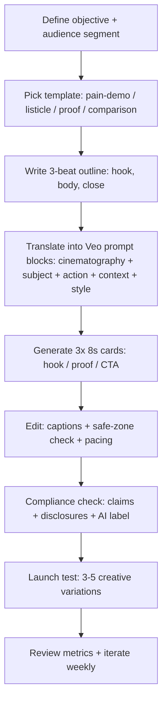

# Deep Research Report on High-Performing Veo3 Prompts for UGC Ads in Software Apps and E‑commerce

## Executive summary

UGC-style ads win on short-form platforms because they compress “trust + clarity + proof” into the first seconds of a vertical video, using creator-native cues (direct-to-camera, handheld framing, lo‑fi realism, fast pacing) and an explicit value proposition early. TikTok’s own creative guidance recommends a **hook → body → close** structure and notes that the **first six seconds** carry disproportionate impact on ad recall, and that showing the product on screen can meaningfully lift brand outcomes. citeturn1view3

For Veo3 (Veo 3.x / 3.1), the most practical approach for platform-accurate UGC ads is to generate **8-second vertical “cards”** (hook, proof, CTA) and assemble them into 15–30s edits, because Veo 3 models support short clip lengths (4/6/8 seconds) and portrait output (9:16). citeturn17view3turn1view1turn15view0 The Veo prompt structure that consistently improves controllability is a **five-part formula**: **[Cinematography] + [Subject] + [Action] + [Context] + [Style & Ambiance]**, with optional timestamp prompting for multi-beat sequences. citeturn17view0turn17view1

Across **software apps** and **e-commerce**, high-performing UGC templates cluster into a few repeatable “creative primitives”:

- A **problem-first hook** anchored in a relatable moment, then a fast “here’s the fix” demo (apps: screen + face; commerce: product-in-hand). citeturn1view3turn21view0  
- A **listicle** (“3 things…”, “don’t buy until…”), which front-loads value and makes the watch feel earned. citeturn21view0  
- **Social proof + objection handling** (retargeting), using creator credibility cues and concrete proof points. citeturn21view0turn3view5  
- A crisp **CTA** aligned to platform behavior (install, start trial, shop now, learn more) and delivered inside safe zones / UI-friendly space. citeturn1view3turn3view0turn3view5  

This report provides (a) a categorized template library (with shot lists, hooks, CTAs, and variations), (b) vertical-by-vertical pattern analysis by funnel stage, (c) 20 ready-to-use Veo3 prompts for TikTok / Instagram Reels / YouTube Shorts constraints, and (d) creator briefing, disclosure/legal notes, testing plans, and KPI/budget guidance grounded in platform and regulatory sources.

## Evidence base, platform constraints, and operating assumptions

The guidance below is grounded in three primary source buckets:

**Veo3 generation capabilities and parameters.** Official documentation for Veo on Vertex AI and the Gemini API defines: portrait support (`9:16`), short clip lengths for Veo 3 models (4/6/8 seconds), required `generateAudio` for Veo 3, resolution options (720p/1080p; 4k in some preview modes), seeds for determinism, and negative prompts. citeturn1view1turn15view0 The Google Cloud prompt guide adds a structured prompt formula, soundstage direction, and timestamp prompting patterns. citeturn17view0turn17view1

**Short-form ad specs and placement behavior.**
- TikTok in-feed auction specs are 9:16 recommended; documentation also references downloadable safe-zone files and notes that Spark Ads captions are extracted from organic captions (max ~4 lines displayed), while non‑Spark captions display in a uniform style. citeturn3view0  
- TikTok advertising policy guidance states many ads must be **5–60 seconds** and should include audio; it also warns against fake UI prompts and other format issues. citeturn4view2  
- YouTube Shorts ads guidance recommends vertical 9:16 and notes that while ads can be longer, only the first 180 seconds play in the Shorts feed; it also recommends 10–30s action-oriented creative and highlights that using sound can materially increase conversions. citeturn3view5turn6search16  
- YouTube announced Shorts uploads up to 3 minutes (square or taller aspect ratios). citeturn6search6  
- Instagram Reels aspect ratios officially support a range up to 9:16 (official Help Center). citeturn5search17  
- Meta safe-zone guidance is partly gated in official pages; reputable secondary sources widely cite Meta’s “keep ~14% top, 35% bottom, 6% sides” safe-zone guidance for Reels/Stories-style placements. citeturn5search15turn5search2turn5search5turn5search4  

**UGC performance research and case studies.**
- TikTok’s “Creative Codes” and related research emphasize TikTok-first creative, strong hooks, and product-on-screen. citeturn1view3turn0search25  
- TikTok Creative Center “Top Ads” is explicitly positioned as a library of high-performing ads that meet performance thresholds, with metrics and second-by-second analysis. (Screenshots from TikTok’s own Top Ads one-pager.) citeturn18view0turn18view1  
- TikTok case studies show UGC/creator-led creative improving performance outcomes in apps and commerce contexts (e.g., creator-sourced UGC lowering CPI/CAC, improving CTR/ROAS). citeturn11view0turn11view1turn11view4turn11view2turn11view3turn11view5  
- A TikTok/VidMob analysis positions the first six seconds as decisive, with “real people” and direct-to-camera creator framing improving short view-through metrics and downstream outcomes (noting the underlying dataset and attribution as TikTok Marketing Science). citeturn21view0  

### Assumptions and “unknowns” that affect implementation

- **Target country is unspecified.** Regulatory disclosures below emphasize U.S. rules and platform policies; local requirements (EU/UK/other) can differ materially. citeturn20view1turn13search10turn13search3  
- **Budget is unspecified.** The budget ranges provided are recommended testing bands and platform minimums where available (TikTok), not a constraint-based plan. citeturn14search0turn14search6  
- **Veo3 output length reality.** Veo 3 models support short clips (commonly 4/6/8 seconds). For UGC ads that “feel right” at 15–30s, you should plan multi-clip assembly (hook/proof/CTA) or extension workflows where supported. citeturn1view1turn15view0turn17view1  
- **AI disclosure expectations are rising.** TikTok requires labeling realistic AI-generated content and also supports commercial content disclosures (paid partnership / promotional content). citeturn3view3turn13search6turn13search9  

## Categorized Veo3 UGC prompt template library for software apps and e-commerce

The templates below are designed as **portable “UGC ad blueprints.”** You can run them as single 8s clips (Veo-native) or chain them into 15–30s edits using timestamp prompting and/or multiple clips. Veo prompting benefits from structured control (cinematography + subject + action + context + style) and explicit audio instructions. citeturn17view0turn17view1turn15view0

image_group{"layout":"carousel","aspect_ratio":"16:9","query":["UGC ad selfie video creator talking to camera product demo vertical","UGC unboxing vertical video creator natural lighting","app demo UGC vertical video phone screen recording in hand","TikTok style UGC testimonial vertical video"],"num_per_query":1}

### Software apps vertical templates

#### Template A: “Relatable pain → instant fix” (SaaS / productivity / general mobile)

**Goal**: Fast qualification + drive installs/trials by making a common pain vivid, then showing the “aha” fix in seconds. This aligns with TikTok’s recommended hook/body/close structure and the emphasis on communicating value early. citeturn1view3  

**Ideal creator persona**: “Busy operator” (founder, freelancer, student, team lead), comfortable direct-to-camera, credible in a narrow use case.

**Suggested shot list** (for a 24s assembly; also works as 8s “card” slices):
- Hook: selfie, stressed micro-moment (calendar chaos / inbox / missed deadline).
- Demo: phone-in-hand or screen insert showing the 1–2 key actions.
- Proof: one tangible outcome (time saved / cleaner dashboard / fewer steps).
- Close: CTA + “who it’s for” qualifier.

**Hook lines (examples)**:
- “If your to‑do list looks like *this*, do this instead.”
- “I stopped missing deadlines after I set this up.”
- “This is the fastest way I’ve found to [outcome].”

**Primary CTA**: “Start free trial” / “Download and set it up in 2 minutes.”

**Length**: 8s (single card) or 20–30s (3-card chain).

**Tone**: candid, practical, lightly humorous.

**Variations**
- **Short (8s)**: Hook (2s) + 1-step demo (4s) + CTA (2s).
- **Long (24–30s)**: Hook (3–4s) + 2-step demo (10–12s) + proof (6–8s) + CTA (3–4s).
- **Emotional (24s)**: Hook framed as relief (“I was drowning…”) + calm “before/after” + reassurance CTA.

#### Template B: “3 things I wish I knew” (SaaS / mobile apps / onboarding)

**Goal**: Consideration and qualified installs by delivering education as entertainment (listicle pacing), which is a common short-form hook strategy. citeturn21view0  

**Ideal creator persona**: “Helpful explainer” (creator who does tips, workflows, tutorials).

**Shot list**
- Selfie intro: “3 things…”
- Rapid cuts: “Thing #1 / #2 / #3” with micro-demos
- CTA: “Save this / try it today.”

**Hook lines**
- “Three settings you should turn on *right now*.”
- “Don’t pay for [category] before you do this.”

**Primary CTA**: “Download” / “Try free” / “Save this.”

**Length**: 15–30s (best), but can be compressed to an 8s “#1 only” teaser.

**Tone**: confident, quick, “I’ve tested everything.”

**Variations**
- **Short (8s)**: Only “Thing #1” + “Part 2?” tease + CTA.
- **Long (30s)**: Full 3 tips + one proof stat + CTA.
- **Emotional (20s)**: “I wasted months doing this the hard way…”

#### Template C: “Before/After workflow transformation” (productivity, creator tools, B2B-lite)

**Goal**: Make the value visually obvious (messy → clean), which is especially effective when you can show “product on screen” early. citeturn1view3turn21view0  

**Ideal creator persona**: “Systems person” (Notion/Sheets/automation style), likes showing process.

**Shot list**
- Before: chaotic workflow montage (fast cuts).
- After: trimmed, clean dashboard / automation firing.
- Proof: measured outcome (“cut this from 45 min to 10”).
- CTA: “Use my setup / start trial.”

**Hook lines**
- “Here’s how I cut my weekly planning from 45 minutes to 10.”
- “My dashboard used to look insane—now it’s one screen.”

**Primary CTA**: “Try the template” / “Start trial.”

**Length**: 20–30s (ideal), or 8s “before→after reveal.”

**Tone**: satisfying, “oddly satisfying productivity.”

**Variations**
- **Short (8s)**: Smash cut before→after + single outcome line.
- **Long (30s)**: 2-step walkthrough + proof + CTA.
- **Emotional (24s)**: “I felt behind every week…” → relief.

#### Template D: “Fintech hack + credibility cue” (fintech / personal finance apps)

**Goal**: Conversion-ready installs by framing a specific money leak, then showing the “protect me from myself” fix (alerts, canceling subscriptions, budgeting). TikTok fintech examples often center everyday “money mishaps” and use Spark/creator content for authenticity. citeturn11view4  

**Ideal creator persona**: “Responsible friend” (calm, trustworthy, not hype); optionally “reformed overspender.”

**Shot list**
- Hook: confession (“I found $___ leaking…”).
- Demo: app shows subscriptions/charges/alerts.
- Proof: “I canceled X in 30 seconds.”
- CTA: “Install—link in bio” / “Start free.”

**Hook lines**
- “I just found a subscription I forgot about…”
- “If you’ve ever been charged for something you didn’t use—watch.”

**Primary CTA**: “Install” / “Connect accounts” (if appropriate).

**Length**: 15–30s; compressed 8s works if the demo is the hero.

**Tone**: serious but friendly; avoid exaggerated claims.

**Variations**
- **Short (8s)**: One confession + one cancel action + CTA.
- **Long (30s)**: 2–3 common leaks + demo + CTA.
- **Emotional (24s)**: “I felt stupid… then I fixed it.”

#### Template E: “Health app routine + ‘small win’ testimonial” (health / wellness apps)

**Goal**: Trust-building consideration by focusing on routine, small wins, and habit formation rather than dramatic medical promises. (Health claims are higher-risk; see legal notes.) citeturn20view0turn13search12  

**Ideal creator persona**: “Relatable journey” (not a doctor unless truly credentialed), consistent routine creator.

**Shot list**
- Hook: “I’m on day 7…”
- Routine: quick “morning/evening check-in” montage.
- Proof: non-medical outcome (consistency, mood journaling, habit streak).
- CTA: “Try it for 7 days.”

**Hook lines**
- “This finally made me consistent.”
- “If you’re trying to build a habit, start here.”

**Primary CTA**: “Start your 7‑day plan.”

**Length**: 20–30s; 8s “day‑X check in” is a strong hook card.

**Tone**: supportive, calm, authentic.

**Variations**
- **Short (8s)**: Day-X check-in + 1 outcome + CTA.
- **Long (30s)**: 3 routine beats + CTA.
- **Emotional (24s)**: “I was spiraling… now I have a plan.”

#### Template F: “Objection handler: ‘I thought it was… but actually…’” (retargeting for any app)

**Goal**: Retargeting conversion lift by addressing the top 1–2 objections (price, complexity, privacy, time) with proof and a simple next step. YouTube Shorts guidance explicitly recommends remarketing lists and creator assets; use this template for those audiences. citeturn3view5  

**Ideal creator persona**: “Skeptical reviewer,” credible and specific.

**Shot list**
- Hook: objection statement (direct).
- Proof: show the exact feature that neutralizes it.
- Close: CTA + “risk reversal” (trial, cancel anytime) if true.

**Hook lines**
- “I thought this would be complicated—here’s the setup.”
- “I didn’t trust apps like this until I saw this setting.”

**Primary CTA**: “Try it—cancel anytime” (only if accurate).

**Length**: 10–20s (tight); 8s “objection→proof” also works.

**Tone**: candid, no hype.

**Variations**
- **Short (8s)**: objection + one proof shot + CTA.
- **Long (20s)**: objection + 2 proof shots + CTA.
- **Emotional (20s)**: “I wasted money on tools before… this one stuck.”

### E-commerce vertical templates

#### Template G: “Unboxing + first impression verdict” (DTC / marketplaces / electronics)

**Goal**: Awareness-to-consideration by compressing novelty + tactile cues (sound, texture, packaging) into a fast sequence. (Short-form audio matters; Shorts guidance supports using sound and social-native feel.) citeturn3view5  

**Ideal creator persona**: “Honest reviewer,” comfortable giving a verdict + quick demo.

**Shot list**
- Hook: box in frame + “I didn’t expect this…”
- Unboxing: 2–3 satisfying cuts + sound cues
- Demo: 1 key use-case
- CTA: “Get yours” / “Shop now”

**Hook lines**
- “I ordered this at 2am—here’s what showed up.”
- “Unboxing the thing everyone’s been asking me about…”

**Primary CTA**: “Shop now.”

**Length**: 15–25s; 8s works as unboxing teaser + CTA.

**Tone**: excited but believable.

**Variations**
- **Short (8s)**: packaging reveal + 1 tactile close-up + CTA.
- **Long (25s)**: unbox + 1 demo + verdict + CTA.
- **Emotional (20s)**: “Giftable” framing / “my partner loved it.”

#### Template H: “Problem-solution product demo” (beauty, home, accessories, gadgets)

**Goal**: Direct response conversion by demonstrating the product “in action” early; TikTok research emphasizes product interaction as a hook enhancer. citeturn21view0turn1view3  

**Ideal creator persona**: “Daily routine” creator (skincare, cooking, home organization) or “fix-it” gadget tester.

**Shot list**
- Hook: problem close-up (mess, acne texture lighting, tangled cable pile).
- Demo: product use sequence (3 cuts).
- Proof: before/after split (honest, consistent angle).
- CTA: “Shop / link / limited drop.”

**Hook lines**
- “If you have *this* problem, watch this.”
- “I tested the viral [category] thing…”

**Primary CTA**: “Shop now.”

**Length**: 15–30s; 8s can be (problem→solution→before/after).

**Tone**: practical, satisfying.

**Variations**
- **Short (8s)**: problem→solution→after reveal.
- **Long (30s)**: demo + proof + mini FAQ + CTA.
- **Emotional (24s)**: confidence / relief framing (“I finally feel…”)—avoid unsubstantiated claims.

#### Template I: “Try-on / styling ‘3 ways’” (fashion / accessories)

**Goal**: Consideration and AOV lift by showing versatility (outfit changes, quick transitions).

**Ideal creator persona**: “Style friend” (credible wardrobe, good lighting, body-positive tone).

**Shot list**
- Hook: “This piece works with everything.”
- 3 looks: fast transitions synced to beat
- Close: sizing note + CTA

**Hook lines**
- “3 ways to style this for work/weekend/date.”
- “If you hate ‘what do I wear’ stress—this helps.”

**Primary CTA**: “Shop the look.”

**Length**: 20–30s; 8s can be “look #1” teaser + CTA.

**Tone**: upbeat, confident.

**Variations**
- **Short (8s)**: 1 transition + CTA.
- **Long (30s)**: 3 looks + sizing + CTA.
- **Emotional (24s)**: confidence hook (“I needed something that fits *me*…”).

#### Template J: “Comparison / ‘don’t buy until…’” (electronics / high-consideration)

**Goal**: Mid-funnel consideration by contrasting 2–3 alternatives with one clear decision factor.

**Ideal creator persona**: “Hands-on tester” (calm, specific, not overhyped).

**Shot list**
- Hook: “Don’t buy [category] until you check this.”
- Side-by-side: feature comparison (speed, noise, battery, fit)
- Proof: one concrete measurement or scenario
- CTA: “Get the one that matches you.”

**Hook lines**
- “I tried three so you don’t have to.”
- “Here’s what matters *more* than the specs.”

**Primary CTA**: “Learn more” / “Shop now.”

**Length**: 20–45s; 8s used as one comparison point.

**Tone**: credible, measured.

**Variations**
- **Short (8s)**: one decisive comparison + CTA.
- **Long (45s)**: 3 points + recommendation.
- **Emotional (20s)**: frustration hook (“I kept buying the wrong one…”).

#### Template K: “Review snapshot + proof + risk reversal” (DTC conversion)

**Goal**: Conversion by compressing review proof + guarantee + offer (truthfully). TikTok Top Ads Spotlight emphasizes surfacing value props and techniques behind standout ads. citeturn18view1  

**Ideal creator persona**: “Customer voice” (UGC testimonial vibe).

**Shot list**
- Hook: “I didn’t think it would work…”
- Proof: show use + result
- Risk reversal: shipping/returns/warranty if accurate
- CTA: “Order today.”

**Hook lines**
- “I’m picky, but…”
- “This surprised me.”

**Primary CTA**: “Shop now.”

**Length**: 15–30s; 8s can be “proof + guarantee” card.

**Tone**: sincere.

**Variations**
- **Short (8s)**: one proof shot + guarantee line + CTA.
- **Long (30s)**: proof + 2 benefits + CTA.
- **Emotional (24s)**: gift / self-care framing.

#### Template L: “Marketplace bundle / ‘add-to-cart stack’” (marketplaces, bundles, multi-SKU carts)

**Goal**: Increase conversions and basket size via curated “stack” (3 complementary items) and a clear use case.

**Ideal creator persona**: “Curator” (beauty bag, desk setup, travel kit).

**Shot list**
- Hook: “My 3-item [goal] kit.”
- Item 1/2/3: each gets 2–3 seconds with benefit
- Close: “Get the bundle.”

**Hook lines**
- “If you’re building a starter kit, buy these together.”
- “My cart is dangerous—here’s what’s worth it.”

**Primary CTA**: “Shop bundle.”

**Length**: 20–30s; 8s can spotlight “hero item” + bundle mention.

**Tone**: energetic, insider.

**Variations**
- **Short (8s)**: hero item + mention “part of my 3-item stack.”
- **Long (30s)**: 3 items + use case + CTA.
- **Emotional (24s)**: travel / event framing (“I’m packing for…”).

## What performs best: hooks, storytelling arcs, visual styles, and CTAs by vertical and audience segment

This section synthesizes platform guidance + creator/UGC research + case study patterns into actionable “creative rules.” Where direct platform metrics are unavailable, findings are presented as inference based on the cited evidence base.

### Shared patterns that generalize across both verticals

**Hook dominance in early seconds.** TikTok’s own guidance recommends a hook/body/close structure and emphasizes early value communication. citeturn1view3 Independent TikTok/VidMob analysis frames the first six seconds as decisive and associates strong hooks with materially higher engagement and purchase intent (as reported). citeturn21view0

**Human presence + direct-to-camera.** TikTok/VidMob findings indicate everyday people outperform celebrity cues for hook performance and that talking-head, close-to-camera framing lifts short view-through metrics (as reported). citeturn21view0 This aligns with the general short-form UGC aesthetic: face-first, conversational pacing, minimal polish.

**Sound is not optional.** YouTube Shorts ads guidance explicitly recommends using sound and cites conversion lift for sound-on creative (as reported in Google Ads guidance). citeturn3view5 TikTok ad policy likewise requires ads to contain audio. citeturn4view2

**Platform-native UI awareness.** TikTok provides safe zone resources and caption behaviors; ignoring these causes visual loss (CTAs hidden, faces obscured). citeturn3view0

### Software apps: what changes (and why)

#### New users (prospecting / cold)

**Best hooks**: “pain confession” + “one-sentence promise.” In apps, cold audiences often need category framing. Hooks that externalize a pain (lost time, missed deadlines, money leaks) are a high-speed way to qualify the viewer before the demo. This matches TikTok case study patterns where creator-led stories dramatize everyday problems then position the app as the fix. citeturn11view4turn11view1

**Best arcs**: Problem → micro-demo → payoff → “who it’s for.” TikTok recommends structuring toward action and showing product on screen; for apps, that means screen inserts early. citeturn1view3

**Visual styles**: Phone-in-hand screen demo, shoulder-surf angle, quick UI zooms, lo‑fi realism (handheld). The “lo‑fi creator-led” approach is explicitly used in TikTok’s B2B example where creators produced 15–30s UGC that maintained attention. citeturn11view1

**CTAs**: “Download,” “Start free,” “Try it today,” optimized for speed. For cold audiences, CTAs that imply low risk (“free,” “2-minute setup”) generally fit the intent, but must be accurate. (Disclosure and deception rules matter; see legal section.) citeturn20view0turn20view1

#### Retargeting (site visitors, video engagers, cart abandoners)

**Best hooks**: Objection reversal (“I thought it was expensive…”) and “missing piece” framing (“You’re one setting away from…”). YouTube Shorts guidance explicitly recommends remarketing lists; this segment benefits from specificity (pricing, features, proof) rather than broad story. citeturn3view5

**Best arcs**: Objection → proof → risk reversal → CTA. TikTok case studies show performance gains from iterative creative testing and creator-led content scaled through native formats like Spark Ads. citeturn11view4turn11view1

**Visual styles**: Side-by-side comparisons, “myth vs fact” overlays (added in post), quick proof points.

**CTAs**: “Start trial,” “Finish setup,” “Claim offer,” plus urgency only when truthful.

#### Retention (existing users)

This segment is less documented in the provided platform sources, so treat this as an inference: for retention, UGC ads behave more like “feature education” and community building than acquisition, using “3 tips” and “hidden features” formats. This aligns with the listicle/tips hook research patterns reported in TikTok/VidMob and platform emphasis on creator-native content. citeturn21view0turn1view3

### E-commerce: what changes (and why)

#### New users (prospecting)

**Best hooks**: Visual interruption + tactile proof (unboxing, close-up texture, before/after reveal). TikTok Top Ads materials emphasize analyzing frame-by-frame engagement and surfacing standout filming/engagement techniques. citeturn18view0turn18view1

**Best arcs**: “Show, don’t tell” product-in-action within seconds, then benefits, then CTA. TikTok/VidMob research associates creator product interaction and product shots with higher hook metrics (as reported). citeturn21view0

**Visual styles**: Macro closeups, ASMR cues (beauty/nails explicitly referenced in a TikTok beauty case study), quick transitions, consistent lighting. citeturn11view3

**CTAs**: “Shop now,” “Get yours,” “See colors,” “Bundle and save.”

#### Retargeting

**Best hooks**: “Answer the last question” (shipping, sizing, returns), “here’s the real fit,” “here’s what I didn’t expect.”  

**Best arcs**: Proof (review, demo, comparison) → risk reversal/guarantee → CTA.  

**Visual styles**: Try-on fit checks, UGC “honest review” framing, comparison vs alternatives.

**CTAs**: “Complete checkout,” “Limited restock,” “Free shipping ends…” (truth required). citeturn20view0turn20view1

#### Retention

Inference: best retention creative is “new drop,” “how to use better,” and “3 ways to style,” leveraging the listicle/utility pattern and platform-native creator voice. citeturn21view0turn18view1

## Twenty ready-to-use Veo3 prompts for TikTok, Instagram Reels, and YouTube Shorts

### How these prompts are structured (so they work in Veo)

Each prompt below is optimized for:
- **Veo 3.x** short clip generation (8s) and portrait 9:16 output. citeturn1view1turn15view0  
- A three-beat micro-structure using **timestamp prompting**: hook → demo/proof → CTA. citeturn17view1  
- Platform constraints: vertical-first and sound-on. citeturn4view2turn3view5turn3view0  

**Note on captions:** Veo does not universally “guarantee” perfect on-screen text. A common best practice is: **generate video with no baked-in text**, then add captions in post (or use platform auto-captions). TikTok’s Spark Ads caption display behavior is platform-controlled, and safe-zone files are provided. citeturn3view0turn17view2turn1view1

**Default Veo parameters (use unless overridden)**  
- aspectRatio: `"9:16"` citeturn1view1turn15view0  
- durationSeconds: `8` citeturn1view1turn15view0  
- resolution: `"1080p"` (recommended for ad clarity) citeturn1view1turn17view3  
- generateAudio: `true` (required for Veo 3 models in Vertex AI) citeturn1view1  
- negativePrompt (recommended): “no subtitles, no on-screen text, no watermarks, no logos, no distorted hands, no blurry face, no UI gibberish, avoid uncanny smiles” citeturn1view1turn17view2  
- personGeneration: `"allow_adult"` (if available in your interface) citeturn1view1  

### Prompts

#### Prompt set for software apps

**Prompt 1: Productivity app — “inbox chaos fix” (prospecting)**
```text
[00:00-00:02] Handheld selfie video, a tired office worker in a small home office holds up a phone showing 127 unread messages and says, “If your inbox looks like this, do this.”
[00:02-00:06] Over-the-shoulder phone-in-hand demo: the app’s clean dashboard triages messages into 3 categories in one tap; subtle UI clicks; the creator whispers “watch this.”
[00:06-00:08] Back to selfie, relieved smile: “Set it up in two minutes—start the free trial today.” Natural indoor lighting, authentic UGC vibe, slight camera shake, crisp audio.
```

**Prompt 2: SaaS — “3 features you’re not using” (retention/education)**
```text
[00:00-00:02] Direct-to-camera creator in a casual room: “Three settings you should turn on right now.”
[00:02-00:06] Quick montage of 3 micro-demos on a laptop/phone screen (fast cuts, satisfying clicks), each labeled by spoken words only: “Auto-sort, Quick templates, Smart reminders.”
[00:06-00:08] Creator: “Save this and try it today.” Warm, helpful tone, handheld vlog style.
```

**Prompt 3: Fintech — “subscription leak confession” (consideration → install)**
```text
[00:00-00:02] Selfie, kitchen background: “I just found a subscription I forgot about.”
[00:02-00:06] Phone-in-hand close-up: the finance app highlights recurring charges; the creator taps “Cancel” and “Set alert”; subtle notification sound.
[00:06-00:08] Creator: “Install it—stop paying for stuff you don’t use.” Honest, calm tone, no hype.
```

**Prompt 4: Health / habit app — “day-7 streak” (prospecting)**
```text
[00:00-00:02] Morning selfie, soft daylight: “Day 7—and I’m finally consistent.”
[00:02-00:06] Quick routine montage: tapping “Check-in,” logging a 10-minute walk, streak animation; gentle ambient room tone.
[00:06-00:08] Creator: “Try it for 7 days and see if it sticks.” Supportive, reassuring voice.
```

**Prompt 5: Mobile app — “setup is easier than you think” (retargeting objection)**
```text
[00:00-00:02] Creator: “I thought setup would be annoying…”
[00:02-00:06] Screen demo: three taps to complete onboarding; progress bar completes; satisfying click sounds.
[00:06-00:08] Creator: “…it took me 45 seconds. Try it free.” UGC realism, handheld.
```

**Prompt 6: SaaS — “my workflow before vs after” (prospecting)**
```text
[00:00-00:02] Split-screen-style editing (visual only, no text): chaotic sticky notes vs clean dashboard; creator says “Before… after.”
[00:02-00:06] Quick zoom on the dashboard; one automated task triggers; subtle success chime.
[00:06-00:08] Creator: “If you want this kind of calm, start the trial.” Satisfying, calm pacing.
```

**Prompt 7: B2B-lite tool — “founder POV” (consideration)**
```text
[00:00-00:02] Founder selfie in a coworking space: “Here’s what we built to save teams time.”
[00:02-00:06] Over-the-shoulder demo: one workflow runs end-to-end; quick cuts; colleague nods in background.
[00:06-00:08] Founder: “If you do this every week, you’ll love it—learn more.” Authentic vibe, crisp dialogue.
```

**Prompt 8: Creator tool — “template giveaway” (conversion)**
```text
[00:00-00:02] Creator: “Steal my exact setup.”
[00:02-00:06] Screen demo: “Duplicate template” action; clean interface; satisfying click.
[00:06-00:08] Creator: “Grab it now—link in bio.” Energetic, friendly tone.
```

#### Prompt set for e-commerce

**Prompt 9: DTC unboxing — “I didn’t expect this quality”**
```text
[00:00-00:02] Box in frame, creator gasps: “Wait… this is NICE.”
[00:02-00:06] ASMR unboxing montage: tear strip, tissue paper, product close-up texture; crisp paper sounds.
[00:06-00:08] Creator: “Okay—shop it. I get the hype.” Handheld UGC style, natural light.
```

**Prompt 10: Beauty — “before/after reveal”**
```text
[00:00-00:02] Close-up face, creator: “I tried it on one side only.”
[00:02-00:06] Quick application demo (clean, realistic); then a subtle side-by-side turn of the face to show difference; soft ambient sound.
[00:06-00:08] Creator: “If you want this look—shop now.” Honest, non-exaggerated tone.
```

**Prompt 11: Fashion — “3 ways to style” (look #1 teaser)**
```text
[00:00-00:02] Creator holds up one clothing item: “This piece works with everything.”
[00:02-00:06] One fast transition into a full outfit; mirror selfie; quick accessory close-up; upbeat music bed.
[00:06-00:08] Creator: “Want the other two looks? Shop it.” Upbeat, confident vibe.
```

**Prompt 12: Electronics — “don’t buy until you see this”**
```text
[00:00-00:02] Creator: “Don’t buy a [category item] until you check this.”
[00:02-00:06] Hands-on demo: two products side-by-side; one key difference shown clearly (speed/noise/fit); crisp mechanical sounds.
[00:06-00:08] Creator: “This is the one I kept.” Measured, credible tone.
```

**Prompt 13: Kitchen gadget — “one problem, one fix”**
```text
[00:00-00:02] Messy countertop close-up, creator: “If you hate this…”
[00:02-00:06] Gadget in action cleans/solves the mess in quick cuts; satisfying SFX.
[00:06-00:08] Creator: “…you need this. Shop now.” Satisfying, practical style.
```

**Prompt 14: Marketplace bundle — “my 3-item kit”**
```text
[00:00-00:02] Creator packing a bag: “My 3-item travel kit.”
[00:02-00:06] Rapid item reveals with tactile use shots; zipper sounds; quick cuts.
[00:06-00:08] Creator: “Get the bundle—done.” Efficient, confident vibe.
```

**Prompt 15: Skincare — “routine slot”**
```text
[00:00-00:02] Bathroom mirror selfie: “This is the step I stopped skipping.”
[00:02-00:06] Quick routine application demo; consistent lighting; gentle water sounds.
[00:06-00:08] Creator: “If you’re building a routine, start here.” Soft, friendly tone.
```

**Prompt 16: Fitness accessory — “quick proof”**
```text
[00:00-00:02] Creator: “I didn’t think this would matter…”
[00:02-00:06] Demonstration: accessory used in motion; close-up detail; clear impact shown.
[00:06-00:08] Creator: “…but it changed my setup. Shop now.” Honest tone.
```

**Prompt 17: Giftable product — “recipient reaction”**
```text
[00:00-00:02] Creator whispers: “Best gift I’ve given this year.”
[00:02-00:06] Gift reveal moment; recipient smiles and reacts; warm room ambience.
[00:06-00:08] Creator: “If you need a win—shop it.” Warm, emotional tone.
```

**Prompt 18: Beauty nails — “ASMR + product demo”**
```text
[00:00-00:02] Macro nails close-up; creator: “Listen to this.”
[00:02-00:06] ASMR application and finish reveal; crisp tapping sounds; soft music bed.
[00:06-00:08] Creator: “Okay… I’m obsessed. Shop now.” Playful tone.
```

**Prompt 19: Home organization — “before/after cabinet”**
```text
[00:00-00:02] Cabinet chaos close-up; creator: “This was driving me insane.”
[00:02-00:06] Organizer product in action; quick cuts; satisfying placement sounds.
[00:06-00:08] Creator: “Fixed in 5 minutes. Shop now.” Practical, satisfying.
```

**Prompt 20: Price/value — “worth it verdict”**
```text
[00:00-00:02] Creator: “Is it worth it? Yes—here’s why.”
[00:02-00:06] Two benefit-proof shots (durability/detail/fit) shown clearly; crisp audio.
[00:06-00:08] Creator: “If you care about quality, get it.” Confident, credible tone.
```

### Platform parameter “tokens” to attach (TikTok / Reels / Shorts)

Use the same Veo parameters across platforms (9:16, 8s, sound-on). Veo supports portrait and defines these parameters in Vertex AI and Gemini API docs. citeturn1view1turn15view0

For TikTok specifically, also keep in mind caption display constraints (Spark Ads caption extraction and line limits) and safe-zone templates. citeturn3view0turn4view2

For YouTube Shorts, follow Shorts ads guidance: 9:16 assets, sound encouraged, and typical action-oriented ad length guidance (10–30s) if you stitch multiple 8s cards. citeturn3view5

## Creator briefing workflow, legal/disclosure notes, A/B tests, metrics, and a templates comparison table

### Creator briefing best practices (optimized for Veo3 + UGC reality)

1) **Write the brief as “inputs,” not a script.** Veo prompting performs best when you specify cinematography, subject, action, context, and style. Translate your creator brief into those levers (handheld selfie, bathroom lighting, desk setup, outdoors/no outdoors). citeturn17view0turn17view1  

2) **Force a 3-beat structure.** TikTok recommends hook/body/close; insist that every deliverable hits these beats even if you only ship an 8-second card. citeturn1view3  

3) **Use “card” production to scale.** Produce Hook Cards (8s), Proof Cards (8s), CTA Cards (8s) and mix-and-match. This mirrors TikTok’s emphasis on creative refresh and reduces fatigue risk; TikTok case studies also show ongoing creative testing contributing to sustained lifts. citeturn1view3turn11view4turn11view5  

4) **Creator authenticity cues matter.** TikTok/VidMob analysis emphasizes “real people” and conversational framing; avoid overly polished ad staging unless your brand is premium by design. citeturn21view0turn1view3  

5) **Plan for platform UI and captions.** TikTok provides safe-zone files and has specific caption behaviors for Spark vs non‑Spark. Provide creators an overlay template and a rule: faces + key product action stay centered. citeturn3view0turn18view0  

#### Suggested creator briefing workflow (Mermaid)



### Legal and disclosure notes (UGC + AI)

**Advertising disclosures must be clear and conspicuous.** The entity["organization","Federal Trade Commission","us consumer protection agency"] guidance on digital disclosures emphasizes that if a disclosure is necessary to prevent deception and you cannot make it clear and conspicuous, the ad should not run; it also emphasizes audio disclosures for audio claims and sufficient on-screen duration for visual disclosures. citeturn20view0turn20view1

**Endorsements and testimonials: material connections.** FTC updates to endorsement guidance aim to address influencer/social media contexts; disclosures must be presented in ways consumers will actually see and understand. citeturn13search4turn13search10turn13search7

**TikTok commercial content disclosure is mandatory for promotional posts.** TikTok’s creator/business support explicitly instructs creators to turn on the content disclosure setting when promoting a brand/product/service, labeling it as “Paid partnership” or “Promotional content.” citeturn13search6turn13search9

**AI-generated content labeling (TikTok).** TikTok asks/requires labeling of AI-generated content that contains realistic images/audio/video and may auto-label; unlabeled realistic AI content can be removed. citeturn3view3turn2search3

**YouTube paid promotion disclosure.** entity["company","YouTube","video platform"] instructs creators to indicate paid product placements/sponsorships via settings (paid promotion box) so disclosures can be provided to viewers. citeturn13search3

**Veo watermarking.** Google notes that Veo outputs are marked with SynthID watermarking technology. citeturn17view0turn16view3

### A/B test ideas that map cleanly to Veo “card” production

Ground these tests in platform-visible outcomes (thumbstop, watch time, CTR, CPA). TikTok’s Top Ads tooling emphasizes second-by-second performance analysis; mirror that by testing only one variable per creative card. citeturn18view0turn18view1

- **Hook swap test (same body/CTA):** pain confession vs curiosity question vs visual shock (before/after).  
- **Proof type test:** “screen demo” vs “result demo” vs “testimonial claim” (ensure claim substantiation). citeturn20view1  
- **Creator persona test:** “expert vibe” vs “everyday friend” framing (reported to affect hook performance). citeturn21view0  
- **CTA wording test:** “Try free” vs “Get started” vs “Learn more” (by funnel stage).  
- **Sound bed test:** voice-only vs voice + subtle music vs ASMR SFX (sound is recommended and can increase conversions in Shorts ads guidance). citeturn3view5turn4view2  

#### A/B test plan flow (Mermaid)

```mermaid
flowchart TD
  A[Choose KPI: CTR or CPA/ROAS] --> B[Select 1 template + 1 audience segment]
  B --> C[Generate 3 hook variants (8s cards)]
  C --> D[Hold body + CTA constant]
  D --> E[Run split test 3-7 days]
  E --> F{Winner?}
  F -->|Yes| G[Scale winner + refresh proof card]
  F -->|No| H[Change only 1 variable: persona OR promise OR proof]
  G --> I[Creative rotation schedule + fatigue monitoring]
  H --> C
```

### Metrics to track (by objective)

TikTok Ads Manager provides a large set of reporting metrics; use a small “core set” tied to funnel objective. citeturn2search15

**Awareness**
- 2s/6s view-through, average watch time, completion rate, reach, frequency.
- Lift studies where available (platform-dependent). citeturn3view5turn12view1  

**Consideration**
- CTR, landing page view rate, engaged view / watch time, add-to-cart (commerce), lead form completion (B2B).

**Conversion**
- CPA/CAC, ROAS, CVR, purchase value, cost per install (apps), downstream events (trial started → activated).

### Comparison table: templates by objective, KPIs, and indicative budget ranges

**Budget note:** No budget constraints were provided. The ranges below are **testing-oriented** and assume you want enough delivery to compare creatives fairly. TikTok publishes minimum budgets at campaign and ad group levels. citeturn14search0turn14search6

| Template (from library) | Best objective | Best audience segment | Primary KPI | Secondary KPIs | Indicative test budget ranges (weekly) | Notes |
|---|---|---|---|---|---|---|
| A Pain → instant fix (apps) | Conversion | New users | CPA / CPI | CTR, 6s VTR | TikTok: ≥$140/ad group (min $20/day) to ~$1,400+; Shorts/Reels: unspecified | Strong “quick win” hook; keep demo visible early. citeturn14search0turn1view3 |
| B 3 things I wish I knew (apps) | Consideration | New + retention | CTR | watch time, saves | TikTok: ≥$140 to ~$1,400+ | Works well as series; rotate tips weekly. citeturn21view0turn14search0 |
| C Before/After workflow (apps) | Awareness → Consideration | New users | 6s VTR | CTR, installs/trials | TikTok: ≥$140 to ~$1,400+ | Visual reveal drives thumbstop; avoid UI clutter. citeturn1view3turn14search0 |
| D Fintech hack (apps) | Conversion | Retargeting | CPA/CPI | CVR, CTR | TikTok: ≥$140 to ~$2,100+ | Be conservative with claims; prioritize clarity and trust. citeturn11view4turn20view1turn14search0 |
| E Routine + small win (health) | Consideration | New + retention | CTR | watch time | TikTok: ≥$140 to ~$1,400+ | Avoid medical claims unless substantiated and compliant. citeturn20view0turn14search0 |
| F Objection handler (apps) | Conversion | Retargeting | CVR / CPA | CTR | TikTok: ≥$140 to ~$2,100+ | Use remarketing lists (Shorts guidance) and address only 1–2 objections. citeturn3view5turn14search0 |
| G Unboxing (commerce) | Awareness | New users | 2s/6s VTR | CTR | TikTok: ≥$140 to ~$1,400+ | Sound design matters; keep product close-ups early. citeturn3view5turn14search0 |
| H Problem-solution demo (commerce) | Conversion | New + retargeting | ROAS / CPA | ATC rate, CTR | TikTok: ≥$140 to ~$2,800+ | Show product usage in first seconds; avoid exaggerated claims. citeturn21view0turn20view1turn14search0 |
| I 3 ways to style (fashion) | Consideration | New users | CTR | watch time, saves | TikTok: ≥$140 to ~$1,400+ | Great for catalogs; rotate looks and creators. citeturn14search0 |
| J Comparison “don’t buy until” (electronics) | Consideration | Retargeting | CTR | CVR | TikTok: ≥$140 to ~$2,100+ | Keep comparisons fair; focus on 1 decision factor. citeturn14search0turn20view1 |
| K Review + risk reversal (commerce) | Conversion | Retargeting | ROAS | CVR | TikTok: ≥$140 to ~$2,800+ | Disclose partnerships; ensure guarantees/offers are accurate. citeturn20view0turn13search6turn14search0 |
| L Bundle stack (marketplaces) | Conversion | New + retargeting | AOV / ROAS | CTR, CVR | TikTok: ≥$140 to ~$2,800+ | Strong for marketplaces; highlight complementary use case. citeturn18view1turn14search0 |

### Practical implementation notes for Veo3 + UGC ads

- **Keep text out of the generated pixels.** Use negative prompts (“no subtitles / no on-screen text”) and add captions in post; TikTok and Shorts both allow overlays, and TikTok supports auto captions (platform feature referenced in TikTok creative guidance). citeturn17view2turn1view3turn3view0  
- **Use seeds for repeatability in iterative testing.** Vertex AI supports `seed` for deterministic video generation. citeturn1view1  
- **Generate 3–4 samples per prompt where possible, then pick the best takes.** Vertex AI supports multiple samples per request (up to a small number). citeturn1view1  
- **Respect AI labeling and commercial disclosures.** On TikTok, you may need both: “AI-generated content” labeling (for realistic AIGC) and commercial content disclosure for paid partnerships/promotional content. citeturn3view3turn13search6turn13search9