# Building 60-Second UGC-Style Video Ads with Interchangeable Offers and Photo-Generated Character Segments

## Executive summary

A scalable way to produce 60‑second UGC‑style ad variants is to treat each ad as a deterministic “render” of (a) a spoken script template with offer placeholders, (b) a consistent character identity pack (seed images and/or trained adapters), and (c) a fixed timeline that swaps in 1, 2, or *n* photo‑generated cutaways while the narration continues. The primary engineering challenge is **identity consistency** across generated photos (and optionally a talking‑head video), plus **offer swapping** without re-editing timelines by hand.

A practical “Fal.ai-first” pipeline uses Fal.ai’s queued model endpoints and SDK (“subscribe” → request ID → result) to generate: (1) photo segments via FLUX endpoints with LoRA/IP‑Adapter controls, (2) voiceover via TTS/voice cloning endpoints (e.g., F5‑TTS at $0.05 per 1,000 characters), and (3) lip‑sync via Sync’s Lipsync endpoints priced per minute (e.g., lipsync 1.9 at $0.70/min; lipsync 2.0 at $3/min). citeturn3view1turn9view1turn7view0turn4view0turn4view1

To make interchangeable offers work at scale, the script and on‑screen text should be parameterized (e.g., `{{OFFER_HEADLINE}}`, `{{PRICE}}`, `{{DEADLINE}}`) and fed into a renderer (FFmpeg, or a JSON-based render API such as Shotstack and Creatomate). Shotstack explicitly supports assembling edits via JSON through a REST API; Creatomate similarly offers a REST API oriented around template-driven rendering with webhooks. citeturn16view6turn16view7turn11search0turn11search1

From a creative-performance standpoint, platform guidance strongly supports (a) hooks in the first seconds and (b) captions/text overlays. For example, entity["company","TikTok","social platform"]’s creative best-practice guidance emphasizes introducing the proposition in the first 3 seconds, prioritizing hooks early, and using captions/text overlays. citeturn12search0

Ethically and legally, scalable synthetic ads must implement affirmative consent and disclosure norms for voice/likeness, comply with endorsement disclosure rules, and avoid deceptive impersonation. For example, entity["company","OpenAI","ai company"] prohibits using someone’s likeness/voice without consent in misleading ways; the entity["organization","Federal Trade Commission","us consumer protection agency"] Endorsement Guides framework requires truthful advertising and disclosure of material connections; and the U.S. right of publicity protects against unauthorized commercial use of name/likeness and similar indicia of identity. citeturn14search1turn12search3turn13search3

## Creative system for 60-second UGC ads with interchangeable offers

### Timing assumptions for spoken scripts

A 60‑second narration is typically ~140–160 words if you target ~140–160 words per minute; guidance for intelligibility often centers around ~150 wpm as a common benchmark. citeturn12search14turn12search2  
This implies your “offer” must be **short** and “slot-in” rather than a long paragraph: think one tight sentence plus a short CTA.

### A reusable 60-second timing scaffold

The following scaffold is designed so the **offer is a late-binding variable**: you can swap it without rewriting the whole story.

**Hook (0–6s)**  
Goal: pattern interrupt + claim + “why listen.” This aligns with platform guidance to prioritize hooks early and introduce the proposition quickly. citeturn12search0turn12search20

**Credibility + context (6–15s)**  
Who you are / why you tried it / “I was skeptical.”

**Problem → agitation (15–25s)**  
Make it visceral, specific.

**Mechanism + product reveal (25–35s)**  
What it is, how it works (one sentence), why it’s different.

**Proof + demonstration (35–48s)**  
Where a photo segment often fits (before/after, receipt, dashboard, ingredient label).

**Offer insert (48–56s)**  
Short, structured, swappable.

**CTA + close (56–60s)**  
One action step, one urgency cue.

### Script templates with placeholders and exact timing

Below are three templates optimized for swapping offers while keeping pacing stable.

#### Template A: Problem → solution → offer

**0–3s (Hook)**: “If you’re still dealing with {{PAINFUL_SYMPTOM}}, you’re doing one thing wrong.”  
**3–8s**: “I’m {{CREATOR_NAME}}—I tried {{PRODUCT_NAME}} for {{TIMEFRAME}} and it surprised me.”  
**8–18s**: “Here’s what I didn’t realize: {{MISCONCEPTION}}. That’s why {{OLD_METHOD}} kept failing.”  
**18–30s**: “{{PRODUCT_NAME}} works by {{MECHANISM_ONE_LINER}}—so you get {{BENEFIT_1}} and {{BENEFIT_2}} without {{COMMON_DOWNSIDE}}.”  
**30–45s (Photo cutaway window)**: “Look—this is {{PROOF_OBJECT}}.” *(Cut to photo segment(s) while narration continues.)*  
**45–56s (Offer slot)**: “Right now they’re doing {{OFFER_HEADLINE}}: {{OFFER_DETAILS_SHORT}}. Use code {{CODE}} by {{DEADLINE}}.”  
**56–60s (CTA)**: “Tap the link, pick {{PRIMARY_OPTION}}, and you’re set.”

#### Template B: Storytime UGC

**0–4s**: “I almost didn’t post this, but if you’re {{AUDIENCE_SITUATION}}, watch.”  
**4–15s**: “Two weeks ago: {{SHORT_STORY_BEFORE}}. I tried {{PRODUCT_NAME}} because {{TRIGGER}}.”  
**15–30s**: “Day 1–2: {{EARLY_RESULT}}. Day 7: {{MID_RESULT}}. The difference was {{MECHANISM_ONE_LINER}}.”  
**30–50s (Photo window)**: “This photo is literally from {{DATE_OR_CONTEXT}}—you can see {{VISIBLE_PROOF}}.”  
**50–58s (Offer slot)**: “They gave me {{OFFER_HEADLINE}} for my followers. It’s {{OFFER_DETAILS_SHORT}}.”  
**58–60s**: “Go now—link’s here.”

#### Template C: “3 claims + proof + offer”

**0–5s**: “Three reasons {{PRODUCT_NAME}} is the only {{CATEGORY}} I’d recommend.”  
**5–25s**: “One: {{CLAIM_1}}. Two: {{CLAIM_2}}. Three: {{CLAIM_3}}.”  
**25–48s (proof/photos)**: “Here’s the proof—{{PROOF_OBJECT}}.”  
**48–56s (offer)**: “Offer is {{OFFER_HEADLINE}}—{{OFFER_DETAILS_SHORT}}.”  
**56–60s**: “Try it today.”

### Captioning and readability

Short-form platforms repeatedly recommend using on-screen text/captions for clarity; entity["company","TikTok","social platform"] specifically calls out using captions/text overlays to provide context. citeturn12search0  
This matters operationally because captions become another offer “slot” you can swap independently of the base footage.

## Segmenting the 60 seconds with photo-generated inserts

A photo-generated segment can serve three functions: proof, clarity, and pacing reset. The “n photos” pattern is easiest when you predefine windows where the video can safely cut away **without breaking comprehension**.

### Recommended segment patterns

**Single photo segment (1 insert)**  
Use one 4–8s cutaway around “proof” (typically 35–48s). Works best when the photo is a single strong artifact: before/after, receipt, calendar, dashboard.

**Two photo segments (2 inserts)**  
Insert 2–4s early (around the mechanism reveal) + 4–6s later (proof). This often improves retention because it breaks the selfie shot monotony.

**Many photo segments (n inserts)**  
Use a repeating cadence: every ~8–12s, a 1–2s “flash” photo with a bold caption, plus one longer proof segment. This is operationally scalable because the images can be mass-generated and swapped while the base timeline stays fixed.

### A sample timeline (mermaid Gantt)

```mermaid
gantt
  title 60s UGC ad timeline with photo inserts
  dateFormat  s
  axisFormat  %S

  section Spoken segments
  Hook + proposition           :a1, 0, 6
  Credibility + context        :a2, 6, 9
  Problem + agitation          :a3, 15, 10
  Mechanism + reveal           :a4, 25, 10
  Offer + CTA                  :a5, 48, 12

  section Photo-generated inserts
  Photo insert 1 (micro-cut)   :p1, 28, 2
  Photo insert 2 (proof)       :p2, 38, 6
  Photo insert 3 (offer card)  :p3, 48, 4
```



### How photo segments stay “UGC” (not like a slideshow)

Keep the selfie-style pacing by making photo segments feel like:  
1) a creator showing receipts (“I screenshotted this”), or  
2) quick on-phone cutaways with large subtitles + cursor highlights.

Operationally: animate still photos (subtle pan/zoom, light motion blur) to avoid “dead air.” If you generate stills only, you can assemble motion in rendering (FFmpeg/Remotion/Shotstack/Creatomate). citeturn11search3turn11search12turn16view6turn16view7

## Provider landscape: Fal.ai and comparable alternatives

### Fal.ai platform primitives relevant to this use case

Fal.ai model endpoints can be called via:
- a queued interface (`queue.fal.run`) recommended for reliability,
- synchronous execution (`fal.run`), or
- WebSocket submission (`ws.fal.run`). citeturn3view0  

In practice, the Fal.ai client libraries center on `subscribe()`, which submits to a queue and waits for results, plus explicit queue management methods and webhook support for long-running jobs. citeturn3view1  
Fal.ai also provides a pricing API that returns per-endpoint unit pricing and can estimate batch costs; it notes most models use output-based pricing (per image/video with resolution/length adjustments), while some are GPU-based. citeturn3view2turn3view3

On the media side, Fal.ai exposes:
- image generation with control extensions (LoRA, ControlNet, IP‑Adapter, reference guidance) via FLUX endpoints, priced per megapixel (e.g., $0.075/MP for a “FLUX.1 [dev] with extensions” endpoint). citeturn9view1
- LoRA-driven custom generation endpoints (e.g., FLUX.2 LoRA at $0.021/MP) and training endpoints (e.g., “fast training” with a $2 base cost per run scaling by steps). citeturn9view2turn4view6
- voice cloning / TTS endpoints such as F5‑TTS, priced at $0.05 per 1,000 characters and designed for zero-shot cloning using a reference audio sample. citeturn7view0
- lip-sync video transformation endpoints priced per minute (e.g., “lipsync 1.9” at $0.70/min with multiple sync modes; “lipsync 2.0” at $3/min and a “pro” tier at $5/min). citeturn4view0turn4view1

### Comparison table of providers (features, pros/cons, pricing model, API patterns)

> Note: “API endpoints” are shown as **paths or named endpoints** to avoid embedding raw URLs in prose; see each provider’s cited docs for the full base URL patterns.

| Provider | Strengths for this workflow | Key limitations | Pricing model (headline) | API patterns / endpoints |
|---|---|---|---|---|
| Fal.ai | One platform for image generation (LoRA/IP‑Adapter controls), voice cloning, and lip-sync; queued execution + webhooks; pricing API for forecasting. citeturn3view0turn3view1turn3view2turn4view0turn7view0turn9view1 | Some identity-oriented endpoints in the gallery are labeled “research only” (license limitation). citeturn9view0 | Output-based units (per MP, per second, per minute) + compute pricing; example H100 hourly pricing shown. citeturn21view0 | `subscribe(model_id, …)`; queue submit/status/result; three endpoint bases (queue/sync/ws). citeturn3view0turn3view1 |
| entity["organization","Replicate","ai model api platform"] | Huge model catalog; clear HTTP API patterns; webhooks; good for hosting open-source identity/lip-sync models if you want portability. citeturn19view6turn22search2 | API prediction outputs and logs are deleted after ~1 hour by default; you must persist outputs. citeturn22search1turn22search0 | “Pay for what you use”; models billed by time/hardware or by I/O depending on model. citeturn19view7 | `POST /v1/models/{owner}/{name}/predictions`; prediction lifecycle + webhooks. citeturn19view6turn22search2 |
| entity["organization","Hugging Face","ml model hub"] Inference Endpoints | Dedicated endpoints for chosen models; enterprise scalers; good for self-hosted identity/lip-sync stacks where you own the pipeline. citeturn19view5 | You manage more infra knobs (replicas, autoscaling) vs serverless “single call.” | Pay-as-you-go hourly compute billed by minute; examples include ~$0.5/GPU-hr on some instances. citeturn19view5turn19view4 | Endpoint URL per deployment; standard HTTPS inference calls. citeturn19view5 |
| entity["company","OpenAI","ai company"] | High-quality image generation and TTS pricing clarity; strong policy guidance on consent/likeness. citeturn19view2turn19view1turn14search1 | Identity consistency is policy-sensitive; must avoid using real person likeness without rights; model behaviors and endpoints evolve. citeturn14search1 | Image outputs priced per image; TTS priced per 1M characters (e.g., $15). citeturn19view0turn19view1 | Image API supports generations/edits/variations; TTS priced under “TTS” models. citeturn19view2turn19view1 |
| entity["company","Stability AI","image model provider"] | Strong suite of image services (gen/control/edit/upscale) and credit-based pricing; clear deprecation/pricing updates. citeturn20view0turn1search3 | Some services may be deprecated over time (e.g., Stable Video API removed from API per notice). citeturn20view0 | Credit-based; pricing updates published; credits used differ by endpoint and mode. citeturn20view0turn1search3 | Platform API endpoints by service (control/edit/upscale etc.). citeturn20view0 |
| entity["company","HeyGen","ai avatar platform"] | End-to-end avatar video generation; template-based generation with variable replacement; explicit API endpoints for create-video and status; documented credit math. citeturn17search4turn23search5turn17search5turn17search9 | Credit system can be complex; premium engines (e.g., Avatar IV) consume more credits; plan limits apply. citeturn23search5turn16view1 | API plans: Pro $99/100 credits; Scale $330/660 credits; 1 credit can equal 1 minute on some engines; Avatar IV pricing differs. citeturn16view2turn23search5turn23search1 | `POST /v2/video/generate`; `GET /v1/video_status.get`; template generation endpoint `POST /v2/template/{template_id}/generate`. citeturn17search0turn17search9turn17search5 |
| entity["company","D-ID","ai video platform"] | Talking-head generation from image + text/audio; API covers videos, translate, and even “consents” endpoints; auth documented. citeturn16view4turn18search0turn18search2turn18search23 | Pricing page content is partially dynamic; expect plan tiers and validate current costs in console; still requires consent workflows. citeturn10search4turn18search23 | Tiered API pricing plans (trial/build/launch/scale) described on pricing page. citeturn10search4 | Create-video endpoints include `POST /scenes` (and other avatar/video endpoints); Basic auth described; consent upload endpoint exists. citeturn18search6turn18search2turn18search23 |
| entity["company","Shotstack","cloud video editing api"] | Programmatic assembly via JSON; built specifically for templated renders at scale; clear “POST an edit → render → file URL” workflow. citeturn16view6turn11search8 | You still need upstream generation (images, audio, lip-sync) unless you only edit existing footage. | Usage pricing per rendered minute (e.g., $0.20–$0.30/min depending plan). citeturn11search0 | Edit API base `/edit/{version}`; ingest and serve APIs. citeturn16view6 |
| entity["company","Creatomate","video automation api"] | Template-driven video automation; REST API + webhook; explicit bulk generation positioning. citeturn16view7turn11search5 | Credit math depends on resolution/FPS/length; must model costs per format. citeturn11search1 | Credit-based: e.g., ~14 credits per minute at 720p/25fps; 1 image = 1 credit (per pricing FAQ). citeturn11search1 | “Single API endpoint” for rendering + webhook support. citeturn16view7 |
| entity["company","Remotion","video rendering framework"] (Lambda) | Infrastructure-free scaling via AWS Lambda rendering; good when you want full control of visuals and deterministic outputs. citeturn11search10turn11search2 | AWS complexity; cost depends on concurrency, assets, and warm/cold behavior; licensing may apply for companies. citeturn11search18turn11search30 | Example Lambda render costs published; plus AWS costs and potential Remotion licensing fee. citeturn11search2turn11search18 | Render via Remotion Lambda APIs; cost estimation supported. citeturn11search14turn11search10 |

### “Comparable provider” shortlist by function

If you want to assemble your own stack, the most common decomposition is:

- **Image generation + identity controls**: Fal.ai FLUX endpoints with LoRA/IP‑Adapter controls; Replicate-hosted PhotoMaker/InstantID/IP‑Adapter models; Hugging Face Inference Endpoints for dedicated hosting. citeturn9view1turn19view6turn19view5turn15search0turn2search5  
- **Voiceover**: Fal.ai F5‑TTS (reference-audio cloning) vs OpenAI TTS pricing per 1M characters vs policy-constrained voice cloning platforms. citeturn7view0turn19view1turn14search0  
- **Lip-sync / talking head**: Fal.ai Sync Lipsync (per-minute) or avatar-video platforms like HeyGen and D‑ID (credit/tier systems). citeturn4view0turn23search5turn18search6  
- **Assembly + rendering**: JSON rendering APIs (Shotstack/Creatomate) or self-render (FFmpeg/Remotion). citeturn16view6turn16view7turn11search3turn11search10  

## Implementation workflow using Fal.ai with dynamic offer swapping

### End-to-end workflow (mermaid)

```mermaid
flowchart TD
  A[Offer variants table\nCSV/DB] --> B[Script template + variables\n{PRODUCT_NAME, OFFER, CTA}]
  B --> C[Generate narration text\n+ caption text lines]
  C --> D[Voiceover generation\nTTS or voice clone]
  C --> E[Photo segment prompts\nscene-by-scene]
  E --> F[Identity-preserving image gen\nseed/ref/LoRA]
  D --> G[Talking-head strategy\n(choose one)]
  G --> G1[Recorded base selfie video]
  G --> G2[AI avatar video + lip-sync]
  G2 --> H[Lip-sync step\nalign audio/video]
  G1 --> I[Assembler]
  H --> I[Assembler]
  F --> I[Assembler\ninsert/animate photos\nburn captions + offer cards]
  I --> J[QA checks\nsync, duration, policy, typos]
  J --> K[Render + export\n9:16 mp4]
```

Fal.ai-specific operational notes that make this workflow robust:
- Requests are queue-managed; `subscribe()` waits for results, and you can also submit to the queue and retrieve by request ID, with webhooks for async completion. citeturn3view1  
- You can control asset retention by passing an object lifecycle preference header (expiration seconds), which matters for batch pipelines. citeturn3view1  
- Fal.ai offers pricing and pricing-estimate endpoints so your pipeline can estimate spend before running a batch. citeturn3view2turn3view3  

### Offer swapping: templating and variables

A scalable pattern is to maintain 3 template layers:

1) **Script template** (narration text)  
2) **Caption template** (line-level subtitles plus offer card text)  
3) **Visual template** (timeline of segments + which “slots” accept photos)

Example variable set:
- `{{PRODUCT_NAME}}`, `{{CATEGORY}}`, `{{VALUE_PROP}}`
- `{{OFFER_HEADLINE}}` (e.g., “20% off”, “free trial”, “bonus bundle”)
- `{{OFFER_DETAILS_SHORT}}` (max ~12–18 words)
- `{{CODE}}`, `{{DEADLINE}}`, `{{URL_SLUG}}`
- `{{DISCLAIMER_SHORT}}` (if needed)

This is analogous to template-based video generation flows documented in avatar platforms (e.g., HeyGen’s template variables) and video-render APIs (Shotstack/Creatomate). citeturn17search11turn16view6turn16view7

### Character consistency across generated photos

To keep a “character” consistent across photo inserts, use one of these escalating methods (lowest operational cost to highest consistency):

**Prompt-only consistency (fast, weakest)**  
Use a stable character descriptor (“mid‑20s woman, curly dark hair, gold hoops, blue hoodie, warm kitchen lighting”) plus fixed camera language and negative prompts. Fixing a seed helps reproducibility when the model supports it; Fal.ai schemas commonly expose `seed`, and PhotoMaker’s schema explicitly notes that the same seed + prompt yields the same output for the same model version. citeturn3view1turn5view2  

**Reference-image guidance / adapter-based identity (strong, low data)**  
Use identity-preserving approaches from the literature:
- **InstantID**: a plug‑and‑play identity-preserving method using a single facial image with high fidelity. citeturn2search5turn2search2  
- **PhotoMaker**: encodes an arbitrary number of ID images into a “stacked ID embedding” for identity fidelity plus controllability. citeturn15search0turn15search16  
- **IP‑Adapter variants**: use face ID embeddings from face recognition rather than only CLIP image embeddings, to improve identity consistency. citeturn15search1turn15search5  

Operationally, Fal.ai’s FLUX endpoints explicitly support IP‑Adapter integration parameters (as part of “extensions”), and PhotoMaker is available as a Fal.ai model endpoint, making adapter-driven consistency feasible without self-hosting. citeturn9view1turn4view4  

**LoRA training on your character (best for production scale)**  
If you need “same person in many scenes,” train a LoRA on your character dataset and use it across prompts. Fal.ai offers FLUX LoRA endpoints for generation and training endpoints (including a “fast training” option with a stated $2 base cost per run scaling with steps). citeturn9view2turn4view6  
This often yields the most predictable multi-scene consistency because identity is represented as a learned adapter rather than “prompt luck.”

### Lip-sync and voice: TTS vs voice cloning

**TTS (synthetic voices)**  
Pros: consistent quality, minimal risk of violating voice rights.  
Cons: “stock voice” feel unless you tune prosody and pacing.

**Voice cloning (reference audio)**  
Pros: creator-like authenticity, consistent persona.  
Cons: consent and impersonation risks; implement explicit consent workflows.

Fal.ai options:
- F5‑TTS explicitly supports reference-audio cloning and is priced per 1,000 characters. citeturn7view0  
- Some voice cloning schemas include markup for pauses (e.g., `<#x#>` pause markers), which is useful for aligning narration timing to a fixed 60s timeline. citeturn6view3  

Policy note: major providers increasingly require consent and prohibit impersonation without legal right; entity["company","OpenAI","ai company"] states its policies prohibit impersonation without consent or legal right and restrict misleading use of likeness/voice. citeturn14search0turn14search1  
entity["company","ElevenLabs","voice ai company"] similarly publishes prohibited-use restrictions, including election-related impersonation constraints, and describes consent/verification practices in its materials. citeturn13search24turn13search12turn13search4  

**Lip-sync alignment**  
If you generate or modify talking-head footage, prefer tools that handle duration mismatches explicitly. Fal.ai’s Sync lipsync endpoints expose multiple duration modes (cut_off, loop, bounce, silence, remap) precisely for audio/video length conflicts. citeturn4view0turn4view1  
This matters for “interchangeable offers” because the offer sentence length can shift slightly across variants; you need either strict script-length control or a system that can remap/extend without manual editing.

### Automation snippets (pseudocode)

```python
# PSEUDOCODE: batch generate 60s variants with offer swapping

offers = load_csv("offers.csv")  # rows: product_name, offer_headline, code, deadline, etc.

for row in offers:
    script = render_template("ugc_script.txt", row)
    captions = render_template("captions.srt.tmpl", row)

    # 1) Generate voiceover audio (TTS/voice clone)
    vo = fal_subscribe("fal-ai/f5-tts", {
        "gen_text": script,
        "ref_audio_url": row["voice_ref_audio_url"],
        # optional: reference transcript, language, etc.
    })

    # 2) Generate photo cutaways with consistent character
    images = []
    for scene in photo_scene_plan():  # e.g., 3 scenes
        prompt = render_template(scene.prompt_tmpl, row)
        img = fal_subscribe("fal-ai/flux-2/lora", {
            "prompt": prompt,
            "seed": scene.seed,
            "loras": [{"path": row["character_lora_id"], "scale": 0.9}],
            "image_size": "portrait_9_16",
        })
        images.append(img)

    # 3) Generate talking-head base (choose one)
    base_video = row["recorded_selfie_video_url"]  # or generated avatar
    lipsynced = fal_subscribe("fal-ai/sync-lipsync", {
        "video_url": base_video,
        "audio_url": vo["audio_url"],
        "sync_mode": "remap",
    })

    # 4) Assemble final mp4 with photo inserts + captions
    output = render_video_timeline(
        base=lipsynced["video_url"],
        inserts=images,
        captions=captions,
        offer_card=row
    )

    # 5) QA gates
    assert duration(output) >= 59 and duration(output) <= 61
    assert no_policy_flags(output)
    publish(output)
```

(Use Fal.ai queue + webhook patterns for throughput; validate costs with Fal.ai pricing estimate before running large batches.) citeturn3view1turn3view3

## Cost and scalability estimates for 1, 10, 100, 1,000 variants

These are **engineering estimates** using published unit prices where available; actual totals depend on resolution, retries, queue time, and how many photo inserts you generate per variant.

### Unit-cost building blocks (examples)

- **Fal.ai photo generation via FLUX.2 LoRA**: $0.021 per megapixel. citeturn9view2  
- **Fal.ai voice cloning via F5‑TTS**: $0.05 per 1,000 characters. citeturn7view0  
- **Fal.ai lip-sync via Sync lipsync 1.9**: $0.70 per minute; lipsync 2.0: $3 per minute. citeturn4view0turn4view1  
- **Shotstack rendering**: $0.20–$0.30 per rendered minute on pricing page. citeturn11search0  
- **HeyGen API**: Pro plan indicates $99 for 100 credits; published credit mapping includes 1 credit = 1 minute for some engines and a higher rate for AvatarIV (~6 credits/min) with 30-second increments. citeturn16view2turn23search5  
- **Replicate retention constraint**: API outputs removed after ~1 hour by default, so storage egress/persistence is a required cost line item at scale. citeturn22search1turn22search0  

### Scenario A: Fal.ai photos + Fal.ai voice + Fal.ai lipsync + external assembly

Assumptions:
- 60s narration ≈ 1,000 characters billed
- 4 photo inserts at ~2 MP each (vertical)
- lipsync 1.9 for 1 minute
- 1 minute render on Shotstack

Per-variant estimate:
- Voice: $0.05 citeturn7view0  
- Photos: 4 × (2 MP × $0.021/MP) ≈ $0.168 citeturn9view2  
- Lip-sync: $0.70 citeturn4view0  
- Render: ~$0.20–$0.30 citeturn11search0  
**Total** ≈ **$1.12–$1.22 per variant** (plus storage/egress and retries).

Batch costs (linear scaling):
- 1 variant: ~$1.2
- 10 variants: ~$12
- 100 variants: ~$120
- 1,000 variants: ~$1,200

Cost reducers:
- Use fewer photo inserts, or reuse a pre-generated “character proof pack” across many offers.
- Keep lipsync constant by recording a base video per persona and only swapping offer cards/photos (no new lipsync pass).
- Use Fal.ai’s pricing estimate endpoint as a “preflight” to prevent runaway spend. citeturn3view3turn3view2  

### Scenario B: HeyGen template videos + external photo generation

If you use HeyGen for the base avatar video, you can keep offer swapping fully template-driven:
- 1 minute video on a mapping of 1 credit/min → cost per credit depends on plan ($0.99 in Pro; $0.50 in Scale). citeturn16view2turn23search5  
So a 60s video is approximately:
- Pro: ~$0.99 per variant
- Scale: ~$0.50 per variant

Then add photo generation costs (Fal.ai FLUX.2 LoRA example above: ~$0.168 for 4 inserts). citeturn9view2  
Total per variant is roughly:
- Pro: ~$1.16
- Scale: ~$0.67

This path is appealing when you want **template variable replacement** (HeyGen supports template endpoints) and don’t want to run lip-sync yourself. citeturn17search5turn17search11turn17search0  

### Throughput considerations (time-to-render)

At scale you should assume:
- queued inference (Fal.ai / Replicate / HeyGen / D‑ID) requires async orchestration and webhooks
- output URLs may expire (Replicate explicitly notes a 1-hour default retention for API outputs) citeturn22search1turn22search0  
- you need a persistence layer (S3/GCS/R2) and an idempotent job runner

For Fal.ai specifically, queue submit + webhook patterns are documented for long-running requests, and object lifecycle headers can control asset expiration windows, both of which become critical beyond ~100 variants per batch. citeturn3view1turn3view1  

## Quality, QA metrics, and ethical/legal considerations

### QA metrics that catch “silent failures”

**Creative/marketing telemetry**
- Hook retention: 3-second view rate, 6-second hold, average watch time, completion rate.
- Action metrics: CTR, CVR, CPA/ROAS by offer variant.

**Audio-visual correctness**
- Lip-sync: evaluate with established sync metrics/models; the Wav2Lip paper introduced rigorous evaluation benchmarks/metrics and demonstrates near real-synced accuracy on benchmarks. citeturn15search2turn15search10  
- ASR transcript match: run speech-to-text and ensure the transcript matches the templated script (catches truncated offers).
- Loudness normalization: consistent LUFS across variants.

**Identity consistency checks**
- Face similarity scoring between reference and generated photos (automated face embedding distance).
- Drift checks: outfit/prop constraints; “character signature” attributes (hair, glasses, tattoos) must persist.

**Render integrity**
- Duration must be within tolerance (e.g., 59–61s).
- Captions present, within safe margins, no overflow, offer text correct.

### Ethical and legal considerations you should implement as system requirements

**Consent, likeness, and impersonation**
- The right of publicity protects against unauthorized commercial use of a person’s name/likeness and related indicia. citeturn13search3  
- Platform policies often prohibit using someone’s likeness/voice without consent in misleading ways (e.g., OpenAI’s usage policies explicitly call this out). citeturn14search1  
- For voice cloning, build a consent and verification workflow; ElevenLabs materials describe consent/verification and warn that cloning without permission may violate privacy/publicity/impersonation laws. citeturn13search12turn13search4turn13search3  

**Disclosures and endorsements**
- If the ad implies endorsement or includes influencer-like claims, follow entity["organization","Federal Trade Commission","us consumer protection agency"] guidance on truthful advertising and disclosing material connections. citeturn12search3turn12search11turn12search19  

**Copyright and ownership**
- The entity["organization","U.S. Copyright Office","us government agency"] AI guidance emphasizes human authorship requirements and provides policy guidance for works containing AI-generated material. citeturn13search2turn13search6  
Practically, treat IP ownership and licensing as a contract issue: store provenance (which model, prompt, seed, training data rights) per asset.

**Deception and detectability risk**
- Human audiences often struggle to reliably detect AI-generated voice clones; published research shows detection inconsistency, increasing misuse risk if consent/disclosure is weak. citeturn13search17  

**Provider-specific ethics**
- entity["company","D-ID","ai video platform"] publishes an ethics pledge around responsible synthetic media use, and entity["company","HeyGen","ai avatar platform"] also publishes guidance on ethical synthetic media use and moderation. citeturn14search2turn14search3turn14search30  

### Recommended compliance controls (minimum viable)

- Maintain a “persona registry”: for every character voice/face, store signed consent, scope, expiration, and allowed uses.
- Hard-block prompts containing real public-figure names unless you have explicit rights.
- Watermarking/provenance: keep internal metadata even if you don’t visibly watermark.
- Keep an audit trail: variant → inputs → outputs → publication destinations.

These controls align with the direction of major synthetic voice policy discussions emphasizing explicit consent and disclosure. citeturn14search0turn14search7turn12search3